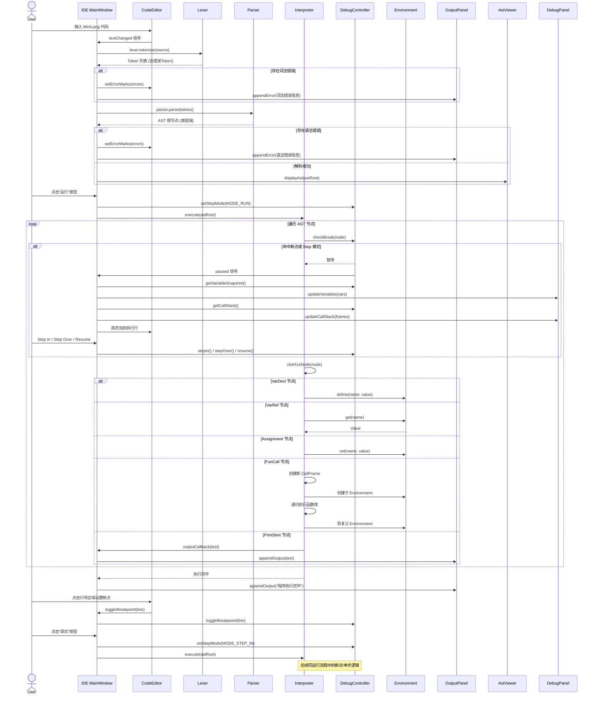
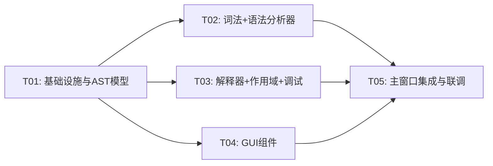

# MiniLang 迷你编程语言解释器与执行可视化平台 — 系统架构设计

---

## Part A: 系统设计

### 1. 实现方案与框架选型

#### 1.1 核心技术挑战

| 挑战 | 说明 | 解决策略 |
|------|------|----------|
| AST 节点多态与内存管理 | 16+ 种 AST 节点类型，生命周期复杂 | 统一 ASTNode 基类 + `std::unique_ptr` 树式所有权，Interpreter 仅持有观察指针 |
| 访问者模式双分派 | 解释器 + 调试器需遍历同棵 AST | Visitor 基类定义 `visit(XxxNode*)` 虚函数，各节点 `accept(Visitor&)` 转发 |
| 作用域链与函数调用栈 | 递归深度 ≥ 256，变量查找需沿链回溯 | Environment 单链表结构，Interpreter 维护 `std::vector<CallFrame>` 调用栈 |
| 调试器断点与单步执行 | 解释器需在指定节点暂停并交出控制权 | StepControl 枚举控制执行模式，AST 节点记录行号，访问时检查断点集合 |
| AST 可视化自动布局 | 树形节点自动排列到 QGraphicsView | 递归布局算法：叶节点定宽，父节点居中于子节点之上，QGraphicsScene 管理 |
| 语法高亮实时更新 | 编辑时即时反馈 | QSyntaxHighlighter 子类，基于正则 + 状态机识别 Token 类型并着色 |

#### 1.2 架构模式

采用 **分层管道架构**，数据单向流动：

```
源代码 → [Lexer] → Token流 → [Parser] → AST → [Interpreter] → 输出
                                  ↓
                            [AST Visualizer]
                                  ↓
                         QGraphicsScene 渲染
```

GUI 层采用 **MVC 变体**：
- **Model**: Interpreter / AST / Environment（语言引擎核心）
- **View**: CodeEditor / AstViewer / OutputPanel / DebugPanel（Qt Widget）
- **Controller**: IDE 主窗口协调信号槽，DebugController 控制执行流

#### 1.3 框架选型

| 组件 | 选型 | 理由 |
|------|------|------|
| UI 框架 | Qt 6.10.3 (Widgets) | PRD 指定，QSyntaxHighlighter / QGraphicsView 原生支持 |
| 构建系统 | MSVC 2022 + .vcxproj | 已有项目模板 |
| 词法分析 | 手写 Lexer | PRD 要求，无需 flex/bison |
| 语法分析 | 递归下降 Parser | PRD 要求，直观易调试 |
| AST 遍历 | 访问者模式 | 经典双分派，支持解释器 + 调试器 + 可视化多 Visitor |
| 内存管理 | `std::unique_ptr` | AST 节点树式所有权清晰，无 GC 开销 |

#### 1.4 模块划分

```
┌─────────────────────────────────────────────────────┐
│                    IDE (MainWindow)                  │
│  ┌──────────┐ ┌───────────┐ ┌─────────────────────┐ │
│  │CodeEditor│ │AstViewer  │ │OutputPanel/DebugPanel│ │
│  └──────────┘ └───────────┘ └─────────────────────┘ │
├─────────────────────────────────────────────────────┤
│              DebugController (调试控制)               │
├─────────────────────────────────────────────────────┤
│  ┌─────────┐  ┌─────────┐  ┌──────────────────────┐ │
│  │  Lexer  │→│  Parser  │→│    Interpreter        │ │
│  └─────────┘  └─────────┘  │  ┌────────────────┐  │ │
│                             │  │  Environment   │  │ │
│                             │  └────────────────┘  │ │
│                             └──────────────────────┘ │
├─────────────────────────────────────────────────────┤
│              AST Nodes (数据模型)                     │
└─────────────────────────────────────────────────────┘
```

---

### 2. 文件列表

```
ide/
├── main.cpp                          # 程序入口
├── ide.h / ide.cpp / ide.ui / ide.qrc  # 主窗口（已有，需改造）
│
├── lexer/
│   ├── Token.h                       # Token 类型定义与 Token 结构体
│   ├── Lexer.h                       # Lexer 类声明
│   └── Lexer.cpp                     # Lexer 实现（手写扫描器）
│
├── ast/
│   ├── ASTNode.h                     # ASTNode 基类 + 所有节点子类声明
│   └── ASTNode.cpp                   # 节点 accept 实现
│
├── parser/
│   ├── Parser.h                      # Parser 类声明
│   └── Parser.cpp                    # 递归下降语法分析实现
│
├── interpreter/
│   ├── Value.h                       # Value 联合体 / 运行时值类型
│   ├── Environment.h                 # Environment 作用域链
│   ├── Environment.cpp
│   ├── Visitor.h                     # Visitor 抽象基类
│   ├── Interpreter.h                 # Interpreter 类声明
│   └── Interpreter.cpp               # 访问者模式解释执行
│
├── debug/
│   ├── DebugController.h             # 调试控制器（断点/单步/变量监视）
│   └── DebugController.cpp
│
├── gui/
│   ├── CodeEditor.h                  # 代码编辑器（行号+高亮+错误下划线）
│   ├── CodeEditor.cpp
│   ├── SyntaxHighlighter.h           # QSyntaxHighlighter 子类
│   ├── SyntaxHighlighter.cpp
│   ├── AstViewer.h                   # AST 树形可视化（QGraphicsView）
│   ├── AstViewer.cpp
│   ├── OutputPanel.h                 # 输出与错误面板
│   ├── OutputPanel.cpp
│   ├── DebugPanel.h                  # 变量监视面板
│   └── DebugPanel.cpp
│
└── docs/
    ├── system_design.md              # 本文档
    ├── class-diagram.mermaid
    └── sequence-diagram.mermaid
```

---

### 3. 数据结构与接口

```mermaid
classDiagram
    direction TB

    %% ===== Token =====
    class Token {
        +TokenType type
        +string lexeme
        +Value literal
        +int line
        +int column
        +toString() string
    }

    class TokenType {
        <<enumeration>>
        TK_VAR TK_FUN TK_IF TK_ELSE TK_WHILE TK_FOR TK_RETURN
        TK_TRUE TK_FALSE TK_AND TK_OR TK_NOT TK_PRINT
        TK_INT TK_FLOAT TK_BOOL TK_STRING_TYPE
        TK_IDENTIFIER TK_INT_LIT TK_FLOAT_LIT TK_STRING_LIT
        TK_PLUS TK_MINUS TK_STAR TK_SLASH TK_PERCENT
        TK_EQ TK_NEQ TK_LT TK_GT TK_LEQ TK_GEQ
        TK_ASSIGN TK_LPAREN TK_RPAREN TK_LBRACE TK_RBRACE
        TK_SEMICOLON TK_COMMA TK_EOF TK_ERROR
    }

    Token --> TokenType

    %% ===== AST Nodes =====
    class ASTNode {
        <<abstract>>
        +int line
        +int column
        +accept(Visitor& v) void
    }

    class BinaryOp {
        +ASTNode* left
        +string op
        +ASTNode* right
        +accept(Visitor& v) void
    }

    class UnaryOp {
        +string op
        +ASTNode* operand
        +accept(Visitor& v) void
    }

    class NumberLiteral {
        +Value value
        +accept(Visitor& v) void
    }

    class StringLiteral {
        +string value
        +accept(Visitor& v) void
    }

    class BoolLiteral {
        +bool value
        +accept(Visitor& v) void
    }

    class VarDecl {
        +string name
        +string typeHint
        +ASTNode* initializer
        +accept(Visitor& v) void
    }

    class Assignment {
        +string name
        +ASTNode* value
        +accept(Visitor& v) void
    }

    class VarRef {
        +string name
        +accept(Visitor& v) void
    }

    class IfStmt {
        +ASTNode* condition
        +Block* thenBranch
        +Block* elseBranch
        +accept(Visitor& v) void
    }

    class WhileStmt {
        +ASTNode* condition
        +Block* body
        +accept(Visitor& v) void
    }

    class ForStmt {
        +ASTNode* init
        +ASTNode* condition
        +ASTNode* update
        +Block* body
        +accept(Visitor& v) void
    }

    class FunDecl {
        +string name
        +vector~Param~ params
        +Block* body
        +accept(Visitor& v) void
    }

    class FunCall {
        +string callee
        +vector~ASTNode*~ args
        +accept(Visitor& v) void
    }

    class ReturnStmt {
        +ASTNode* value
        +accept(Visitor& v) void
    }

    class PrintStmt {
        +ASTNode* value
        +accept(Visitor& v) void
    }

    class Block {
        +vector~ASTNode*~ statements
        +accept(Visitor& v) void
    }

    ASTNode <|-- BinaryOp
    ASTNode <|-- UnaryOp
    ASTNode <|-- NumberLiteral
    ASTNode <|-- StringLiteral
    ASTNode <|-- BoolLiteral
    ASTNode <|-- VarDecl
    ASTNode <|-- Assignment
    ASTNode <|-- VarRef
    ASTNode <|-- IfStmt
    ASTNode <|-- WhileStmt
    ASTNode <|-- ForStmt
    ASTNode <|-- FunDecl
    ASTNode <|-- FunCall
    ASTNode <|-- ReturnStmt
    ASTNode <|-- PrintStmt
    ASTNode <|-- Block

    %% ===== Value =====
    class Value {
        +ValueType type
        +int intVal
        +double floatVal
        +bool boolVal
        +string stringVal
        +isInt() bool
        +isFloat() bool
        +isBool() bool
        +isString() bool
        +isNumber() bool
        +toDouble() double
        +toString() string
        +isTruthy() bool
    }

    class ValueType {
        <<enumeration>>
        VAL_INT VAL_FLOAT VAL_BOOL VAL_STRING VAL_NULL
    }

    Value --> ValueType

    %% ===== Environment =====
    class Environment {
        -unordered_map~string,Value~ variables
        -Environment* parent
        +define(name: string, val: Value) void
        +get(name: string) Value
        +set(name: string, val: Value) void
        +allVariables() unordered_map~string,Value~
        +getParent() Environment*
    }

    Environment --> Environment : parent

    %% ===== Visitor =====
    class Visitor {
        <<abstract>>
        +visitBinaryOp(BinaryOp*) Value
        +visitUnaryOp(UnaryOp*) Value
        +visitNumberLiteral(NumberLiteral*) Value
        +visitStringLiteral(StringLiteral*) Value
        +visitBoolLiteral(BoolLiteral*) Value
        +visitVarDecl(VarDecl*) Value
        +visitAssignment(Assignment*) Value
        +visitVarRef(VarRef*) Value
        +visitIfStmt(IfStmt*) Value
        +visitWhileStmt(WhileStmt*) Value
        +visitForStmt(ForStmt*) Value
        +visitFunDecl(FunDecl*) Value
        +visitFunCall(FunCall*) Value
        +visitReturnStmt(ReturnStmt*) Value
        +visitPrintStmt(PrintStmt*) Value
        +visitBlock(Block*) Value
    }

    %% ===== Interpreter =====
    class Interpreter {
        -Environment* globalEnv
        -Environment* currentEnv
        -vector~CallFrame~ callStack
        -DebugController* debugger
        -function~void(string)~ outputCallback
        +Interpreter()
        +execute(program: ASTNode*) void
        +setOutputCallback(cb: function) void
        +setDebugger(dc: DebugController*) void
        +getGlobalEnv() Environment*
        +getCurrentEnv() Environment*
        +visitBinaryOp(BinaryOp*) Value
        +visitUnaryOp(UnaryOp*) Value
        +visitNumberLiteral(NumberLiteral*) Value
        +visitStringLiteral(StringLiteral*) Value
        +visitBoolLiteral(BoolLiteral*) Value
        +visitVarDecl(VarDecl*) Value
        +visitAssignment(Assignment*) Value
        +visitVarRef(VarRef*) Value
        +visitIfStmt(IfStmt*) Value
        +visitWhileStmt(WhileStmt*) Value
        +visitForStmt(ForStmt*) Value
        +visitFunDecl(FunDecl*) Value
        +visitFunCall(FunCall*) Value
        +visitReturnStmt(ReturnStmt*) Value
        +visitPrintStmt(PrintStmt*) Value
        +visitBlock(Block*) Value
    }

    class CallFrame {
        +string funcName
        +Environment* env
        +int returnLine
    }

    Interpreter --> Visitor
    Interpreter --> Environment
    Interpreter --> CallFrame
    Interpreter --> DebugController

    %% ===== Lexer =====
    class Lexer {
        -string source
        -int start
        -int current
        -int line
        -int column
        +Lexer(source: string)
        +tokenize() vector~Token~
        -advance() char
        -peek() char
        -peekNext() char
        -match(expected: char) bool
        -makeToken(type: TokenType) Token
        -scanToken() Token
        -scanString() Token
        -scanNumber() Token
        -scanIdentifier() Token
    }

    %% ===== Parser =====
    class Parser {
        -vector~Token~ tokens
        -int current
        +Parser(tokens: vector~Token~)
        +parse() Block*
        -peek() Token
        -previous() Token
        -advance() Token
        -check(type: TokenType) bool
        -match(types: TokenTypeList) bool
        -consume(type: TokenType, msg: string) Token
        -declaration() ASTNode*
        -varDecl() ASTNode*
        -funDecl() ASTNode*
        -statement() ASTNode*
        -ifStmt() ASTNode*
        -whileStmt() ASTNode*
        -forStmt() ASTNode*
        -printStmt() ASTNode*
        -returnStmt() ASTNode*
        -block() Block*
        -expression() ASTNode*
        -assignment() ASTNode*
        -or_() ASTNode*
        -and_() ASTNode*
        -equality() ASTNode*
        -comparison() ASTNode*
        -term() ASTNode*
        -factor() ASTNode*
        -unary() ASTNode*
        -primary() ASTNode*
        -call() ASTNode*
    }

    Parser --> Token
    Parser --> ASTNode

    %% ===== DebugController =====
    class StepMode {
        <<enumeration>>
        MODE_RUN MODE_STEP_IN MODE_STEP_OVER MODE_PAUSE
    }

    class DebugController {
        -set~int~ breakpoints
        -StepMode mode
        -bool paused
        -Interpreter* interp
        +DebugController()
        +setBreakpoint(line: int) void
        +removeBreakpoint(line: int) void
        +toggleBreakpoint(line: int) void
        +clearBreakpoints() void
        +hasBreakpoint(line: int) bool
        +setStepMode(mode: StepMode) void
        +checkBreak(node: ASTNode*) bool
        +isPaused() bool
        +resume() void
        +stepIn() void
        +stepOver() void
        +stop() void
        +getVariableSnapshot() unordered_map~string,Value~
        +getCallStack() vector~CallFrame~
    }

    DebugController --> StepMode
    DebugController --> Interpreter

    %% ===== GUI Components =====
    class CodeEditor {
        -SyntaxHighlighter* highlighter
        -QList~QTextEdit::ExtraSelection~ errorMarks
        +CodeEditor(QWidget* parent)
        +lineNumberAreaWidth() int
        +setErrorMarks(errors: vector~ErrorInfo~) void
        +clearErrorMarks() void
        +getCurrentLine() int
        +toggleBreakpoint(line: int) signal
    }

    class SyntaxHighlighter {
        +SyntaxHighlighter(QTextDocument*)
        +highlightBlock(text: string) void
    }

    class AstViewer {
        -QGraphicsScene* scene
        +AstViewer(QWidget* parent)
        +displayAst(ASTNode* root) void
        -layoutNode(node: ASTNode*, x: double, y: double) QPointF
        -createNodeItem(node: ASTNode*, pos: QPointF) QGraphicsItem*
    }

    class OutputPanel {
        -QTextEdit* outputText
        -QTextEdit* errorText
        +OutputPanel(QWidget* parent)
        +appendOutput(text: string) void
        +appendError(text: string) void
        +clear() void
    }

    class DebugPanel {
        -QTreeWidget* varTree
        -QListWidget* callStackList
        +DebugPanel(QWidget* parent)
        +updateVariables(vars: unordered_map~string,Value~) void
        +updateCallStack(frames: vector~CallFrame~) void
        +clear() void
    }

    class IDE {
        -CodeEditor* editor
        -AstViewer* astViewer
        -OutputPanel* outputPanel
        -DebugPanel* debugPanel
        -Lexer* lexer
        -Parser* parser
        -Interpreter* interpreter
        -DebugController* debugger
        +IDE(QWidget* parent)
        +onRun() void
        +onDebug() void
        +onStepIn() void
        +onStepOver() void
        +onStop() void
        +onToggleBreakpoint(line: int) void
        +onEditorTextChanged() void
        +updateTokenView() void
        +updateAstView() void
    }

    IDE --> CodeEditor
    IDE --> AstViewer
    IDE --> OutputPanel
    IDE --> DebugPanel
    IDE --> Lexer
    IDE --> Parser
    IDE --> Interpreter
    IDE --> DebugController
    CodeEditor --> SyntaxHighlighter
```



---

### 4. 程序调用流程



---

### 5. 待明确事项

| # | 问题 | 当前假设 |
|---|------|----------|
| 1 | `var` 声明是否需要类型注解？如 `var x: int = 10;` | 不需要，类型由初始值推导；但保留 typeHint 字段供 P1 扩展 |
| 2 | 函数是否支持闭包（捕获外层变量）？ | 假设支持闭包语义，FunDecl 注册时记录定义时的 Environment |
| 3 | `for` 循环的 init/cond/update 是否可以为空？如 `for (;;) {}` | 假设不可，init 必须是 VarDecl 或 Assignment，cond/update 必须是表达式 |
| 4 | 字符串是否支持转义字符（`\n`, `\t`, `\"`）？ | 假设支持基本转义：`\n` `\t` `\\` `\"` |
| 5 | 递归调用栈深度 256 是硬限制还是软限制？ | 假设硬限制，超过时抛出 RuntimeError |
| 6 | 多文件/模块支持？ | P0 不支持，仅单文件执行 |
| 7 | Qt 版本最低兼容要求？ | 按 PRD 使用 Qt 6.10.3，不向下兼容 |
| 8 | AST Viewer 中节点点击是否跳转到源码对应行？ | 假设支持（P1 扩展），P0 仅做树形展示 |

---

## Part B: 任务分解

### 6. 依赖包列表

| 包 | 版本 | 用途 |
|----|------|------|
| Qt Core | 6.10.3 | 基础类型、信号槽、容器 |
| Qt Widgets | 6.10.3 | QMainWindow, QWidget, QSplitter 等 |
| Qt GUI | 6.10.3 | QFont, QPainter, QSyntaxHighlighter |
| Qt Graphics | 6.10.3 | QGraphicsView, QGraphicsScene, QGraphicsItem |

> 无第三方依赖，仅使用 Qt 6 标准模块与 C++17 标准库。

---

### 7. 任务列表（按依赖顺序）

#### T01: 项目基础设施与 AST 数据模型

**关联文件**：
- `main.cpp`（改造入口，注册元类型）
- `lexer/Token.h`（TokenType 枚举 + Token 结构体）
- `ast/ASTNode.h`（ASTNode 基类 + 16 种节点子类声明）
- `ast/ASTNode.cpp`（各节点 accept 方法实现）
- `interpreter/Value.h`（ValueType 枚举 + Value 结构体，运算辅助方法）

**内容**：
1. 改造 `main.cpp` 为 IDE 入口，注册 `Value` 为 Qt 元类型（用于信号槽传参）
2. 定义 `TokenType` 枚举覆盖所有 Token 类型
3. 定义 `Token` 结构体包含 type、lexeme、literal、line、column
4. 定义 `ASTNode` 抽象基类含 line/column + 纯虚 `accept()`
5. 定义 16 种 AST 节点子类（BinaryOp, UnaryOp, NumberLiteral, StringLiteral, BoolLiteral, VarDecl, Assignment, VarRef, IfStmt, WhileStmt, ForStmt, FunDecl, FunCall, ReturnStmt, PrintStmt, Block）
6. 定义 `ValueType` 枚举和 `Value` 结构体，实现类型检查、类型转换、truthiness 判断

**依赖**：无
**优先级**：P0

---

#### T02: 词法分析器 + 语法分析器

**关联文件**：
- `lexer/Lexer.h` + `lexer/Lexer.cpp`（手写扫描器）
- `parser/Parser.h` + `parser/Parser.cpp`（递归下降解析器）

**内容**：
1. Lexer 实现：
   - 逐字符扫描，跳过空白与注释
   - 识别关键字（查表）、标识符、整数/浮点数字面量、字符串字面量（含转义）
   - 识别所有运算符和分隔符
   - 错误时生成 TK_ERROR Token 记录行号列号，尝试恢复（跳到下一个分号或换行）
2. Parser 实现：
   - 递归下降，运算符优先级通过调用层级体现
   - 声明层：varDecl / funDecl
   - 语句层：ifStmt / whileStmt / forStmt / printStmt / returnStmt / block / exprStmt
   - 表达式层：assignment → or → and → equality → comparison → term → factor → unary → call → primary
   - 错误恢复：同步到声明边界（var/fun/}等），收集多个错误
   - 所有 AST 节点记录行号列号

**依赖**：T01
**优先级**：P0

---

#### T03: 解释器 + 作用域与调试控制

**关联文件**：
- `interpreter/Environment.h` + `interpreter/Environment.cpp`（作用域链）
- `interpreter/Visitor.h`（Visitor 抽象基类）
- `interpreter/Interpreter.h` + `interpreter/Interpreter.cpp`（树遍历解释器）
- `debug/DebugController.h` + `debug/DebugController.cpp`（调试控制器）

**内容**：
1. Environment 实现：
   - `define(name, val)` 在当前作用域定义变量
   - `get(name)` 沿链查找变量，未找到抛出 RuntimeError
   - `set(name, val)` 沿链查找并修改，未找到抛出 RuntimeError
   - `allVariables()` 返回当前及所有祖先作用域的变量快照
2. Visitor 抽象基类：定义 16 个 visit 虚函数
3. Interpreter 实现：
   - 继承 Visitor，实现所有 visit 方法
   - 维护全局 Environment 和当前 Environment 指针
   - 函数调用：创建 CallFrame 压栈 → 创建子 Environment → 执行函数体 → 弹栈恢复
   - 递归深度检查（≥ 256），超限抛出 RuntimeError
   - ReturnStmt 通过 ReturnException 异常机制跳出函数体
   - 算术运算自动类型提升（int + float → float）
   - 短路求值（and / or）
   - outputCallback 回调输出到 GUI
4. DebugController 实现：
   - 断点集合管理（QSet\<int\>）
   - StepMode 枚举（RUN / STEP_IN / STEP_OVER / PAUSE）
   - checkBreak 在每个 AST 节点执行前调用，命中时通过 QWaitCondition 暂停线程
   - 变量快照与调用栈查询接口

**依赖**：T01
**优先级**：P0

---

#### T04: GUI 组件（编辑器 + AST 可视化 + 输出面板 + 调试面板）

**关联文件**：
- `gui/CodeEditor.h` + `gui/CodeEditor.cpp`（行号 + 断点标记 + 错误下划线）
- `gui/SyntaxHighlighter.h` + `gui/SyntaxHighlighter.cpp`（语法高亮）
- `gui/AstViewer.h` + `gui/AstViewer.cpp`（AST 树形图）
- `gui/OutputPanel.h` + `gui/OutputPanel.cpp`（输出 + 错误显示）
- `gui/DebugPanel.h` + `gui/DebugPanel.cpp`（变量监视 + 调用栈）

**内容**：
1. CodeEditor：
   - 继承 QPlainTextEdit，左侧绘制行号区域（LineNumberArea）
   - 行号区域点击设置/取消断点（红色圆点标记）
   - setErrorMarks 在错误行显示红色波浪下划线
   - 当前执行行黄色高亮
2. SyntaxHighlighter：
   - QSyntaxHighlighter 子类
   - 关键字→蓝色粗体，字符串→绿色，数字→橙色，注释→灰色，运算符→紫色
3. AstViewer：
   - QGraphicsView + QGraphicsScene
   - 递归布局算法：叶节点等宽，父节点居中于子节点上方
   - 节点用圆角矩形 + 文字标签，边用直线连接
   - 支持缩放与拖拽
4. OutputPanel：
   - 上下分割：上半区标准输出（黑字白底），下半区错误输出（红字）
   - 清空按钮
5. DebugPanel：
   - QTreeWidget 显示变量名/类型/值（支持作用域层级折叠）
   - QListWidget 显示调用栈（函数名 + 行号）
   - Step In / Step Over / Resume / Stop 按钮行

**依赖**：T01
**优先级**：P0

---

#### T05: 主窗口集成与端到端联调

**关联文件**：
- `ide.h` + `ide.cpp` + `ide.ui`（主窗口改造）
- `ide.qrc`（资源文件：图标等）

**内容**：
1. IDE 主窗口布局（ide.ui 改造）：
   - 工具栏：运行 / 调试 / Step In / Step Over / 停止 / 清空输出
   - 左侧：CodeEditor（占 60% 宽度）
   - 右侧：QTabWidget 切换 Token 列表 / AST 视图
   - 底部：QTabWidget 切换输出面板 / 调试面板
   - QSplitter 实现可拖拽调整大小
2. IDE 逻辑（ide.cpp）：
   - onRun()：Lexer → Parser → Interpreter → 输出
   - onDebug()：同 onRun 但设置 StepMode
   - onStepIn / onStepOver / onStop：操控 DebugController
   - onEditorTextChanged()：实时更新 Token 视图和语法高亮
   - 连接信号槽：断点切换、变量更新、行高亮
3. Token 列表视图：QTableWidget 显示 type / lexeme / line / column
4. 错误处理：词法/语法/运行时错误统一显示到 OutputPanel 错误区 + Editor 错误标记
5. 端到端测试：用 MiniLang 示例程序验证完整流程

**依赖**：T02, T03, T04
**优先级**：P0

---

### 8. 共享知识

```
- 命名规范：
  - 类名：PascalCase（ASTNode, Lexer, Parser, Interpreter）
  - 方法名：camelCase（tokenize, visitBinaryOp, setBreakpoint）
  - 成员变量：camelCase 带下划线后缀（source_, current_, breakpoints_）—— 或按 Qt 惯例不带后缀
  - 枚举值：ALL_CAPS（TK_VAR, VAL_INT, MODE_STEP_IN）
  - 文件名：PascalCase 与类名一致（Lexer.h, ASTNode.h）

- 内存管理：
  - AST 节点：Parser 产出后由 std::unique_ptr<ASTNode> 管理，IDE 持有根节点，子节点随析构递归释放
  - Environment：Interpreter 管理，函数调用时 new 子 Environment，函数返回时 delete
  - Qt 对象：遵循 Qt 父对象树，Widget 自动析构

- 信号槽约定：
  - 跨线程（调试暂停/恢复）使用 Qt::QueuedConnection
  - 输出回调：Interpreter 通过 std::function 回调，IDE 转发为信号到 OutputPanel
  - 断点切换：CodeEditor → IDE::toggleBreakpoint(int) → DebugController

- 错误处理：
  - 词法错误：生成 TK_ERROR Token，不抛异常，Lexer 继续扫描
  - 语法错误：Parser 抛出 ParseError，外层 catch 收集后继续同步恢复
  - 运行时错误：Interpreter 抛出 RuntimeError（含行号列号消息），IDE 捕获显示
  - Return 语句：通过 ReturnException（继承 std::exception）跳出函数体

- AST 节点行号约定：
  - 每个节点记录其首个 Token 的 line 和 column
  - 用于错误报告、调试行高亮、断点匹配

- Value 类型提升规则：
  - int op int → int（除法例外：int / int → int 截断，与 C 一致）
  - int op float → float（int 提升为 float）
  - float op float → float
  - string + string → string 拼接
  - bool 不参与算术运算
```

---

### 9. 任务依赖图



> T02、T03、T04 之间无依赖，可并行开发。仅 T01 为公共前置，T05 为最终集成。
