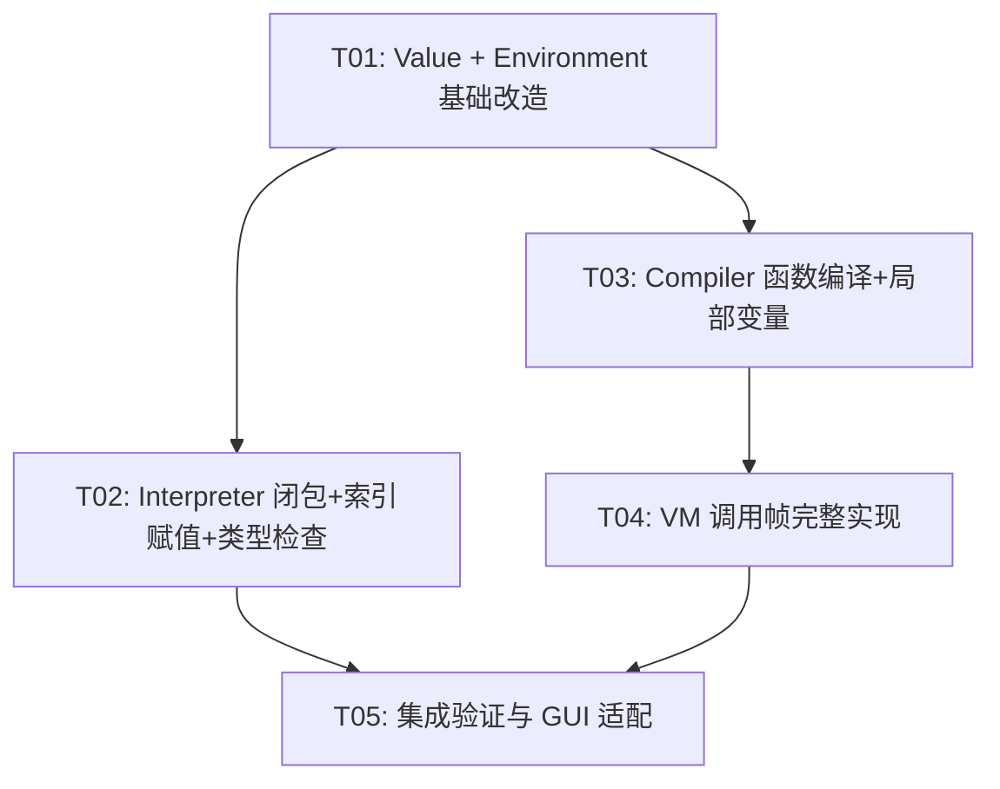

# MiniLang 四大增强 — 系统设计方案

> 架构师：高见远 (Gao)
> 日期：2025-07

---

## Part A: 系统设计

### 1. 实现方案总览

#### 核心技术挑战

| 增强项 | 难点 | 关键决策 |
|--------|------|---------|
| VM 调用帧 | 无帧结构，无局部变量表，函数体未编译 | 引入 CallFrame + 独立 BytecodeChunk；Compiler 为每个函数生成独立 chunk |
| 索引赋值值语义 | Value 是纯值类型，嵌套赋值需 copy-modify-write | 递归解析左值链，从最内层向外逐级写回 |
| 闭包 Upvalue | 函数值仅为字符串标记，使用调用时环境 | 函数值扩展为携带闭包环境引用的结构；引入 shared_ptr 管理 Environment 生命周期 |
| 运行时类型检查 | 类型注解存在但从未使用 | 在 VarDecl/Assignment/FunCall/ReturnStmt 四处增加检查，跳过空注解以零开销支持无类型代码 |

#### 架构模式

- **Interpreter 路径**（tree-walking）：闭包 + 索引赋值 + 类型检查主要在此路径实现
- **VM 路径**（bytecode）：调用帧主要在此路径实现，闭包在 VM 中也需对应支持
- **Compiler 路径**：需将函数体编译为独立 BytecodeChunk，为 VM 调用帧提供数据基础
- 两条执行路径保持独立，互不干扰

---

### 2. 增强一：VM 调用帧

#### 2.1 设计目标

将 VM 从"仅支持全局变量 + 占位 OP_CALL"升级为支持函数调用帧、局部变量、返回值的完整栈式虚拟机。

#### 2.2 数据结构变更

**VMCallFrame（新增）**

```cpp
struct VMCallFrame {
    const BytecodeChunk* chunk;     // 当前执行的字节码块指针
    size_t ip;                      // 返回地址（调用者的 IP）
    size_t basePointer;             // 栈基指针（帧底，参数从 bp-argCount 开始）
    std::string functionName;       // 函数名（调试用）
};
```

**VM 类新增成员**

```cpp
std::vector<VMCallFrame> frames_;                              // 调用帧栈
std::unordered_map<std::string, BytecodeChunk> functionChunks_; // 函数名 → 独立字节码块
static constexpr size_t MAX_FRAMES = 256;                      // 最大帧深度
```

**BytecodeChunk 扩展**

```cpp
// 新增字段
std::string name;                  // chunk 名称（函数名）
int arity = 0;                     // 参数个数
```

#### 2.3 Compiler 编译策略

当前 `compileFunDecl` 仅记录函数名。需改为：

1. **遇到 FunDecl 时**：在全局 chunk 中先 emit `OP_DEFINE_VAR funName`（值为占位 null），然后 emit `OP_CLOSURE nameIdx`（编译期记录函数名索引和参数个数）
2. **函数体独立编译**：创建新的 `BytecodeChunk`，设置 `name` 和 `arity`，编译函数体中的语句，末尾自动添加 `OP_RETURN`
3. **编译完成后**：将独立 chunk 注册到 Compiler 的 `functionChunks_` 映射中，最终随 `compile()` 结果返回

新增指令：

| 指令 | 操作数 | 说明 |
|------|--------|------|
| `OP_CLOSURE` | nameIdx(2B) + argCount(1B) | 创建闭包值，压入栈 |
| `OP_GET_LOCAL` | slot(1B) | 读取当前帧的局部变量 |
| `OP_SET_LOCAL` | slot(1B) | 写入当前帧的局部变量 |
| `OP_CLASS_NEW` | nameIdx(2B) + argCount(1B) | 类构造调用 |

**compileFunDecl 改造后的流程**：

```
compileFunDecl(FunDecl& node):
  1. 为函数体创建独立 BytecodeChunk subChunk
  2. subChunk.name = node.name, subChunk.arity = node.params.size()
  3. 在 subChunk 中为每个参数预留局部变量槽位 (slot 0..arity-1)
  4. 编译 node.body 到 subChunk
  5. subChunk 末尾添加 OP_NULL + OP_RETURN (隐式返回)
  6. 将 subChunk 存入 functionChunks_[node.name]
  7. 在主 chunk 中: OP_NULL → OP_DEFINE_VAR funName → OP_CLOSURE nameIdx argCount
```

**compileFunCall 改造**：

```
compileFunCall(FunCall& node):
  1. 编译所有参数（按顺序压栈）
  2. 生成 OP_GET_VAR funName（将函数闭包值压栈）
  3. emit OP_CALL argCount
```

> 注：OP_CALL 编码改为 `OP_CALL argCount(1B)`，被调用函数从栈顶弹出闭包值。

#### 2.4 VM 执行流程

**OP_CLOSURE 执行**：

```
1. 从常量池取函数名 name
2. 创建闭包值 Value，类型为 VAL_CLOSURE，携带 name 和 arity
3. 压入栈
```

**OP_CALL 执行**：

```
1. 读取 argCount
2. 从栈顶弹出闭包值 callee
3. 查找 functionChunks_[callee.closureName] 获取目标 chunk
4. 检查 arity == argCount
5. 创建 VMCallFrame:
   - chunk = &functionChunks_[name]
   - ip = 当前帧的 ip（调用者恢复点）
   - basePointer = stack_.size() - argCount
   - functionName = name
6. frames_.push_back(frame)
7. ip = 0（跳转到函数字节码起始）
```

**OP_RETURN 执行**：

```
1. 弹出返回值 result
2. 弹出当前帧 frame = frames_.back(); frames_.pop_back()
3. 将栈截断到 frame.basePointer（丢弃所有局部变量和参数）
4. 压入 result
5. ip = frame.ip（恢复调用者执行位置）
```

**OP_GET_LOCAL / OP_SET_LOCAL**：

```
OP_GET_LOCAL slot:
  1. 获取当前帧 frame = frames_.back()
  2. push(stack_[frame.basePointer + slot])

OP_SET_LOCAL slot:
  1. 获取当前帧 frame = frames_.back()
  2. stack_[frame.basePointer + slot] = peek(0)
```

**OP_METHOD_CALL 执行**：

```
1. 从栈弹出 argCount 个参数值
2. 从栈弹出对象值 obj
3. 读取方法名 methodName
4. 查找类方法 → 获取方法 chunk
5. 绑定 this 到局部变量 slot 0
6. 创建 VMCallFrame（basePointer 包含 this + 参数）
7. 跳转执行方法 chunk
```

**类构造调用 OP_CLASS_NEW**：

```
1. 读取类名 nameIdx, argCount
2. 创建实例 Value（VAL_INSTANCE）
3. 查找 init 方法 chunk
4. 绑定 this + 参数到帧
5. 执行 init
6. 弹帧，压入实例值
```

#### 2.5 编译结果结构变更

`Compiler::compile()` 返回类型需从单个 `BytecodeChunk` 变为包含主 chunk 和所有函数 chunk 的复合结构：

```cpp
struct CompileResult {
    BytecodeChunk mainChunk;
    std::unordered_map<std::string, BytecodeChunk> functionChunks;
};
```

VM 的 `execute()` 接口相应调整，接收 `CompileResult`。

---

### 3. 增强二：索引赋值值语义

#### 3.1 问题分析

当前 `visitIndexAssign` 仅处理 `object` 是 `VarRef` 的情况：

```
arr[i] = val       ✅ VarRef → IndexAssign
obj.field[i] = val ❌ MemberAccess → IndexAssign（链式）
arr[i][j] = val    ❌ IndexAccess → IndexAssign（嵌套）
obj.field[i][j] = val  ❌ MemberAccess → IndexAccess → IndexAssign（混合）
```

根本原因：Value 是值语义，`evaluate(IndexAccess)` 返回的是元素的**副本**而非引用。要修改嵌套元素，必须从最外层容器开始 copy-modify-write。

#### 3.2 递归左值解析方案

**核心思路**：从 IndexAssign 节点出发，沿 `object` 链递归向下，构建"访问路径"，然后从最内层向外逐级 copy-modify-write。

**新增辅助方法**：

```cpp
/// 递归解析左值链，返回修改后的完整外层容器
Value resolveIndexAssign(ASTNode* object, const Value& newVal,
                         int line, int col);
```

**算法**：

```
resolveIndexAssign(object, newVal, line, col):
  if object 是 VarRef:
    // 最外层：直接写回环境
    Value container = currentEnv_->get(varRef->name)
    modifyInPlace(container, pathFromHere, newVal)  // 本层就是最外层
    currentEnv_->set(varRef->name, container)
    return newVal

  if object 是 MemberAccess:
    // 先递归解析内层，获取修改后的内层值
    Value innerObj = evaluate(object->object)  // 评估内层对象
    string field = object->fieldName
    Value modifiedInner = applyAssignToField(innerObj, field, newVal)
    // 将修改后的内层值作为 newVal 向上传递
    return resolveIndexAssign(object->object, modifiedInner, line, col)

  if object 是 IndexAccess:
    Value innerObj = evaluate(object->object)
    Value idx = evaluate(object->index)
    Value modifiedInner = applyAssignToIndex(innerObj, idx, newVal)
    return resolveIndexAssign(object->object, modifiedInner, line, col)
```

**简化方案（推荐）**：不递归解析 AST 链，而是采用"求值-修改-写回"策略：

```
visitIndexAssign(IndexAssign& node):
  1. 求值 index 和 value
  2. 调用 assignToLValue(node.object, idx, val)

assignToLValue(object, idx, val):
  case VarRef:
    // 直接修改环境中的容器
    container = env.get(name)
    modify(container, idx, val)
    env.set(name, container)

  case MemberAccess:
    // 获取外层对象，修改其字段中的容器
    outerObj = evaluate(object.object)  // 这里会返回副本
    modify(outerObj.fields[fieldName], idx, val)
    // 需要把修改后的 outerObj 写回
    assignValueToNode(object.object, outerObj)

  case IndexAccess:
    // 获取外层容器，修改其元素中的容器
    outerContainer = evaluate(object.object)
    outerIdx = evaluate(object.index)
    inner = outerContainer[outerIdx]  // 取出内层
    modify(inner, idx, val)            // 修改内层
    outerContainer[outerIdx] = inner   // 写回外层
    assignValueToNode(object.object, outerContainer)
```

**最终推荐方案**：使用一个递归函数 `assignToLValue`，它接收 AST 节点和一个"修改函数"，从最内层向外应用修改：

```cpp
/// 将值写回到左值表达式对应的存储位置
void writeBack(ASTNode* node, const Value& modifiedValue, int line, int col);

void writeBack(ASTNode* node, const Value& modifiedValue, int line, int col) {
    if (auto* varRef = dynamic_cast<VarRef*>(node)) {
        // 最外层：写回环境
        currentEnv_->set(varRef->name, modifiedValue);
    } else if (auto* memberAccess = dynamic_cast<MemberAccess*>(node)) {
        // 需要修改外层对象的字段
        Value outer = evaluate(memberAccess->object.get());
        if (outer.isInstance()) outer.fields[memberAccess->fieldName] = modifiedValue;
        else if (outer.isDict()) outer.dictVal[memberAccess->fieldName] = modifiedValue;
        writeBack(memberAccess->object.get(), outer, line, col);
    } else if (auto* indexAccess = dynamic_cast<IndexAccess*>(node)) {
        Value outer = evaluate(indexAccess->object.get());
        Value idx = evaluate(indexAccess->index.get());
        if (outer.isArray() && idx.isInt()) outer.arrayVal[idx.intVal] = modifiedValue;
        else if (outer.isDict() && idx.isString()) outer.dictVal[idx.stringVal] = modifiedValue;
        writeBack(indexAccess->object.get(), outer, line, col);
    }
}
```

`visitIndexAssign` 改造为：

```cpp
Value visitIndexAssign(IndexAssign& node) {
    Value idx = evaluate(node.index.get());
    Value val = evaluate(node.value.get());

    // 获取 object 的当前值
    Value obj = evaluate(node.object.get());

    // 在 obj 上执行索引赋值
    if (obj.isArray() && idx.isInt()) {
        obj.arrayVal[idx.intVal] = val;
    } else if (obj.isDict() && idx.isString()) {
        obj.dictVal[idx.stringVal] = val;
    } else {
        runtimeError("该类型不支持索引赋值", node.line, node.column);
    }

    // 递归写回到左值链的每一层
    writeBack(node.object.get(), obj, node.line, node.column);

    return val;
}
```

同理，`visitMemberAssign` 也使用 `writeBack` 支持链式赋值。

#### 3.3 注意事项

- `evaluate` 对 VarRef 调用 `env.get()` 返回的是副本（值语义），所以 writeBack 链中每次 `evaluate` 获取的都是未经修改的原始值，修改后需要逐级写回
- `writeBack` 的递归深度等于左值链的嵌套层数，实际场景中通常不超过 3-4 层
- 此方案不影响 VM 路径（VM 路径的 IndexAssign 另行处理）

---

### 4. 增强三：闭包 Upvalue 机制

#### 4.1 问题分析

当前 `visitFunCall` 中：

```cpp
Environment* funEnv = new Environment(currentEnv_);  // 使用调用时环境
```

但函数应该捕获**定义时环境**（词法作用域）。此外函数值当前只是 `"fun:xxx"` 字符串，不携带闭包环境。

#### 4.2 Value 扩展 — 函数闭包值

在 `ValueType` 枚举中新增 `VAL_CLOSURE`：

```cpp
enum class ValueType {
    VAL_INT, VAL_FLOAT, VAL_BOOL, VAL_STRING, VAL_NULL,
    VAL_ARRAY, VAL_DICT, VAL_INSTANCE,
    VAL_CLOSURE    // 新增
};
```

在 `Value` 结构体中新增闭包字段：

```cpp
// 闭包字段
std::string closureName;                                    // 函数名
std::shared_ptr<Environment> closureEnv;                    // 定义时的闭包环境
std::vector<std::string> closureParams;                     // 参数名列表（副本）
// 注：不存储 FunDecl* 指针，因为 AST 节点由 unique_ptr 管理，生命周期不确定
// 改为存储函数名，运行时通过 funRegistry_ 查找
```

**静态工厂方法**：

```cpp
static Value makeClosure(const std::string& name,
                         std::shared_ptr<Environment> env,
                         const std::vector<std::string>& params) {
    Value v;
    v.type = ValueType::VAL_CLOSURE;
    v.closureName = name;
    v.closureEnv = env;
    v.closureParams = params;
    return v;
}
```

#### 4.3 Environment 生命周期管理

当前 `Environment` 使用裸指针 `parent`，且由 `new/delete` 手动管理。引入 `shared_ptr` 后：

- 闭包环境用 `shared_ptr<Environment>` 引用，保证被捕获的环境不会提前释放
- `Environment` 的 `parent` 改为 `std::shared_ptr<Environment>` 以支持引用计数链
- 非 `shared_ptr` 管理的临时环境（如 `forEnv`, `blockEnv`）改为 `shared_ptr` 或使用 `shared_ptr` 的 `aliasing constructor`

**改造方案**：

```cpp
class Environment : public std::enable_shared_from_this<Environment> {
public:
    std::shared_ptr<Environment> parent;  // 改为 shared_ptr

    explicit Environment(std::shared_ptr<Environment> parentEnv = nullptr)
        : parent(parentEnv) {}

    // define/get/set/hasVariable 接口不变
    // ...
private:
    std::unordered_map<std::string, Value> variables;
};
```

**Interpreter 改造**：

```cpp
// 成员变量
std::shared_ptr<Environment> globalEnv_;
std::shared_ptr<Environment> currentEnv_;
```

所有 `new Environment(...)` 改为 `std::make_shared<Environment>(...)`，所有 `delete env` 移除。

#### 4.4 visitFunDecl 改造

```cpp
Value visitFunDecl(FunDecl& node) {
    checkBreak(&node);

    // 创建闭包值，捕获定义时的当前环境
    Value funVal = Value::makeClosure(
        node.name,
        currentEnv_,    // shared_ptr，捕获定义时环境
        node.params
    );
    currentEnv_->define(node.name, funVal);
    funRegistry_[node.name] = &node;  // 保留函数体注册

    return funVal;
}
```

#### 4.5 visitFunCall 改造

```cpp
Value visitFunCall(FunCall& node) {
    checkBreak(&node);

    // 检查类构造调用（不变）
    // ...

    // 查找函数值（从环境中获取闭包值）
    if (!currentEnv_->hasVariable(node.name)) {
        runtimeError("未定义的函数: " + node.name, node.line, node.column);
    }
    Value callee = currentEnv_->get(node.name);

    if (!callee.isClosure()) {
        // 兼容：可能从 funRegistry_ 查找（旧路径）
        auto it = funRegistry_.find(node.name);
        if (it == funRegistry_.end())
            runtimeError("未定义的函数: " + node.name, node.line, node.column);
        // ... fallback 逻辑
    }

    // 检查参数数量
    if (node.arguments.size() != callee.closureParams.size()) {
        runtimeError(...);
    }

    // 求值参数
    std::vector<Value> argValues;
    for (auto& arg : node.arguments) argValues.push_back(evaluate(arg.get()));

    // 使用闭包环境作为父环境（关键！）
    auto funEnv = std::make_shared<Environment>(callee.closureEnv);

    // 绑定参数
    for (size_t i = 0; i < callee.closureParams.size(); ++i) {
        funEnv->define(callee.closureParams[i], argValues[i]);
    }

    // 压帧
    callStack_.emplace_back(callee.closureName, funEnv.get(), node.line, recursionDepth_);
    recursionDepth_++;

    // 切换环境
    auto prevEnv = currentEnv_;
    currentEnv_ = funEnv;

    Value result = Value::nullValue();
    try {
        FunDecl* funDecl = funRegistry_[callee.closureName];
        result = evaluate(funDecl->body.get());
    } catch (const ReturnException& e) {
        result = e.returnValue;
    }

    // 恢复环境
    currentEnv_ = prevEnv;
    callStack_.pop_back();
    recursionDepth_--;

    return result;
}
```

#### 4.6 方法闭包

方法也需要闭包支持。`ClassDecl` 注册方法时，方法所在类的 `ClassInfo` 需要记录方法闭包。但方法的闭包环境在实例化时才能确定（因为 `this` 绑定）。因此：

- 方法在 `ClassDecl` 时**不**创建闭包
- 方法在调用时（`visitMethodCall`）以**当前环境**为父环境创建临时闭包，绑定 `this`
- 这与当前行为一致（方法始终可以访问调用时的外层变量），但对嵌套函数声明中的闭包是正确的

#### 4.7 Value 新增便捷方法

```cpp
bool isClosure() const { return type == ValueType::VAL_CLOSURE; }
```

`toString()` 中增加 VAL_CLOSURE 分支：

```cpp
case ValueType::VAL_CLOSURE:
    return "<fun:" + closureName + ">";
```

`equals()` 中增加 VAL_CLOSURE 分支（比较函数名和环境指针）。

#### 4.8 内存安全说明

- `shared_ptr<Environment>` 通过引用计数自动管理生命周期
- 闭包捕获的 `closureEnv` 会阻止该环境被回收，直到所有引用它的闭包都被销毁
- `Environment::parent` 也使用 `shared_ptr`，形成完整的引用链
- 潜在的循环引用：如果函数 A 的闭包环境中包含对 A 自身的引用（递归），则 `closureEnv → variables["A"] → closureEnv` 形成循环。解决方案：全局环境 `globalEnv_` 使用 `weak_ptr` 作为 parent，或者接受此循环（因为 Interpreter 的生命周期通常覆盖整个执行期）

---

### 5. 增强四：运行时类型检查

#### 5.1 检查时机

| 操作 | 检查内容 | 类型信息来源 |
|------|---------|-------------|
| `VarDecl` | 初始化值的类型是否匹配 typeAnnotation | VarDecl.typeAnnotation |
| `Assignment` | 赋值值的类型是否匹配变量声明时的注解 | 需查找 VarDecl 的 typeAnnotation |
| `FunCall` 参数 | 实参类型是否匹配形参注解 | FunDecl.paramTypes |
| `ReturnStmt` | 返回值类型是否匹配函数返回值注解 | FunDecl.returnType |

#### 5.2 类型匹配规则

```cpp
bool typeMatch(const Value& val, const std::string& annotation) {
    if (annotation.empty()) return true;  // 无注解 = 不检查

    // 基本类型
    if (annotation == "int")   return val.isInt();
    if (annotation == "float") return val.isFloat() || val.isInt();  // int 可隐式提升为 float
    if (annotation == "bool")  return val.isBool();
    if (annotation == "string") return val.isString();

    // 容器类型
    if (annotation == "array") return val.isArray();
    if (annotation == "dict")  return val.isDict();

    // 泛型容器（如 int[], string[]）
    if (annotation.back() == ']') {
        // e.g., "int[]" → 检查数组元素类型
        if (!val.isArray()) return false;
        std::string elemType = annotation.substr(0, annotation.size() - 2);
        for (const auto& elem : val.arrayVal) {
            if (!typeMatch(elem, elemType)) return false;
        }
        return true;
    }

    // 类名
    if (val.isInstance() && val.className == annotation) return true;

    // null 可赋给任何类型
    if (val.isNull()) return true;

    return false;
}
```

#### 5.3 实现位置

**新增辅助方法到 Interpreter**：

```cpp
/// 类型检查：值的类型是否匹配注解
bool typeMatch(const Value& val, const std::string& annotation) const;

/// 类型检查并报错
void checkType(const Value& val, const std::string& annotation,
               const std::string& context, int line, int col);
```

**VarDecl 中**：

```cpp
Value visitVarDecl(VarDecl& node) {
    // ... 现有逻辑 ...
    if (node.initializer) {
        initVal = evaluate(node.initializer.get());
        if (!node.typeAnnotation.empty()) {
            checkType(initVal, node.typeAnnotation,
                     "变量 " + node.name + " 的类型", node.line, node.column);
        }
    }
    currentEnv_->define(node.name, initVal);
    return initVal;
}
```

**Assignment 中**：

```cpp
Value visitAssignment(Assignment& node) {
    Value val = evaluate(node.value.get());
    // 查找变量声明时的类型注解
    std::string typeAnn = findTypeAnnotation(node.name);
    if (!typeAnn.empty()) {
        checkType(val, typeAnn, "赋值给 " + node.name, node.line, node.column);
    }
    if (!currentEnv_->set(node.name, val)) {
        runtimeError("未定义的变量: " + node.name, node.line, node.column);
    }
    return val;
}
```

**FunCall 参数中**：

```cpp
// 在 visitFunCall 中，参数绑定后
for (size_t i = 0; i < funDecl->params.size(); ++i) {
    if (i < funDecl->paramTypes.size() && !funDecl->paramTypes[i].empty()) {
        checkType(argValues[i], funDecl->paramTypes[i],
                 "函数 " + funDecl->name + " 的参数 " + funDecl->params[i],
                 node.line, node.column);
    }
}
```

**ReturnStmt 中**：

```cpp
Value visitReturnStmt(ReturnStmt& node) {
    Value val = Value::nullValue();
    if (node.value) val = evaluate(node.value.get());

    // 查找当前函数的返回类型注解
    std::string returnType = currentFunctionReturnType_;
    if (!returnType.empty()) {
        checkType(val, returnType, "返回值", node.line, node.column);
    }

    throw ReturnException(val);
}
```

#### 5.4 类型注解存储

需要一个机制在赋值时查找变量的声明类型注解。新增一个映射：

```cpp
std::unordered_map<std::string, std::string> typeAnnotations_;  // 变量名 → 类型注解
```

在 `visitVarDecl` 中注册：

```cpp
if (!node.typeAnnotation.empty()) {
    typeAnnotations_[node.name] = node.typeAnnotation;
}
```

查找方法：

```cpp
std::string findTypeAnnotation(const std::string& varName) const {
    auto it = typeAnnotations_.find(varName);
    if (it != typeAnnotations_.end()) return it->second;
    return "";
}
```

> 注意：此方案简化处理，同一变量名的类型注解以最后一次声明为准。对于块作用域中的同名变量，需要结合作用域链进行更精确的查找，但作为教学语言此简化足够。

#### 5.5 性能考虑

- `typeAnnotation.empty()` 时直接跳过，零开销
- 类型检查仅在注解存在时执行，一次函数调用 + 枚举比较
- 不影响无类型注解代码的性能

---

### 6. 文件列表

| 文件路径 | 操作 | 说明 |
|---------|------|------|
| `interpreter/Value.h` | 修改 | 新增 VAL_CLOSURE、闭包字段、isClosure()、makeClosure() |
| `interpreter/Environment.h` | 修改 | parent 改为 shared_ptr，继承 enable_shared_from_this |
| `interpreter/Environment.cpp` | 修改 | 适配 shared_ptr 改动（如有非内联方法） |
| `interpreter/Interpreter.h` | 修改 | 新增 writeBack()、typeMatch()、checkType()、findTypeAnnotation()；成员变量改为 shared_ptr；新增 typeAnnotations_ |
| `interpreter/Interpreter.cpp` | 修改 | 改造 visitFunDecl/visitFunCall/visitIndexAssign/visitMemberAssign/visitVarDecl/visitAssignment/visitReturnStmt |
| `compiler/Bytecode.h` | 修改 | 新增 OP_CLOSURE/OP_GET_LOCAL/OP_SET_LOCAL/OP_CLASS_NEW；BytecodeChunk 新增 name/arity；新增 CompileResult |
| `compiler/Compiler.h` | 修改 | 新增 functionChunks_ 成员；compile() 返回 CompileResult |
| `compiler/Compiler.cpp` | 修改 | 改造 compileFunDecl/compileFunCall，新增闭包和局部变量编译 |
| `compiler/VM.h` | 修改 | 新增 VMCallFrame、frames_、functionChunks_；execute() 接收 CompileResult |
| `compiler/VM.cpp` | 修改 | 实现完整 OP_CALL/OP_RETURN/OP_METHOD_CALL/OP_CLOSURE/OP_GET_LOCAL/OP_SET_LOCAL |
| `docs/system_design.md` | 新增 | 本文档 |
| `docs/sequence-diagram.mermaid` | 新增 | 调用时序图 |
| `docs/class-diagram.mermaid` | 新增 | 类图 |

---

### 7. 数据结构与接口（类图）

见 `docs/class-diagram.mermaid`

---

### 8. 程序调用流程（时序图）

见 `docs/sequence-diagram.mermaid`

---

### 9. 不明确之处

1. **VM 路径中的闭包支持**：VM 路径中是否也需要完整的闭包支持？当前设计中 VM 路径的 OP_CLOSURE 仅在 Compiler 中生成闭包值，但 VM 执行时函数的闭包环境如何绑定？建议第一期 VM 路径仅支持全局函数调用（无闭包），闭包完整支持仅限 Interpreter 路径。

2. **shared_ptr 循环引用**：递归函数的闭包会形成循环引用（闭包捕获的环境包含闭包自身）。如果 Interpreter 长期运行，需要考虑用 weak_ptr 打破循环。当前设计假设 Interpreter 生命周期覆盖整个程序执行，循环引用在 Interpreter 销毁时由整体释放解决。

3. **类型检查与类继承**：如果子类实例赋给声明为父类类型的变量，是否应该通过检查？当前设计通过（`val.isInstance() && val.className == annotation` 需扩展为继承链检查），但实现复杂性增加。建议初期仅支持精确匹配。

4. **Dict 类型注解**：如 `dict<string, int>` 的泛型字典注解，当前 Parser 可能不支持此语法。建议初期仅支持 `dict` 粗粒度检查。

---

## Part B: 任务分解

### 10. 所需包

本项目为 Qt/C++ 项目，无需额外第三方包。所有增强基于现有技术栈：
- Qt 6.10.3 + MSVC 2022 + VS2026
- C++17（shared_ptr, enable_shared_from_this）

---

### 11. 任务列表

#### T01: 基础设施 — Value 与 Environment 生命周期改造

**源文件**：
- `interpreter/Value.h`
- `interpreter/Environment.h`
- `interpreter/Environment.cpp`

**内容**：
1. Value.h：新增 `VAL_CLOSURE` 枚举值、闭包字段（`closureName`, `closureEnv`, `closureParams`）、`isClosure()` 方法、`makeClosure()` 工厂方法；`toString()` 和 `equals()` 增加 VAL_CLOSURE 分支
2. Environment.h：`parent` 改为 `std::shared_ptr<Environment>`；继承 `std::enable_shared_from_this<Environment>`；构造函数参数改为 `shared_ptr`
3. Environment.cpp：适配 shared_ptr 改动

**依赖**：无
**优先级**：P0

---

#### T02: Interpreter 路径 — 闭包 + 索引赋值 + 类型检查

**源文件**：
- `interpreter/Interpreter.h`
- `interpreter/Interpreter.cpp`

**内容**：
1. Interpreter.h：成员变量 `globalEnv_`/`currentEnv_` 改为 `shared_ptr`；新增 `typeAnnotations_` 映射；新增 `writeBack()`、`typeMatch()`、`checkType()`、`findTypeAnnotation()` 辅助方法
2. Interpreter.cpp：
   - 构造/析构函数适配 shared_ptr（移除 delete）
   - `visitFunDecl`：创建闭包值（捕获定义时环境）
   - `visitFunCall`：从闭包值获取闭包环境作为函数的父环境
   - `visitIndexAssign`：使用 `writeBack()` 递归支持链式索引赋值
   - `visitMemberAssign`：使用 `writeBack()` 递归支持链式成员赋值
   - `visitVarDecl`：增加类型检查
   - `visitAssignment`：增加类型检查
   - `visitReturnStmt`：增加返回类型检查
   - 所有 `new Environment(...)` 改为 `make_shared`
   - 所有块/循环/方法调用中的环境管理适配 shared_ptr

**依赖**：T01
**优先级**：P0

---

#### T03: Compiler 路径 — 函数体编译与局部变量

**源文件**：
- `compiler/Bytecode.h`
- `compiler/Compiler.h`
- `compiler/Compiler.cpp`

**内容**：
1. Bytecode.h：
   - 新增 `OP_CLOSURE`、`OP_GET_LOCAL`、`OP_SET_LOCAL`、`OP_CLASS_NEW` 操作码
   - BytecodeChunk 新增 `name` 和 `arity` 字段
   - 新增 `CompileResult` 结构体（包含 mainChunk 和 functionChunks）
   - 反汇编方法支持新指令
2. Compiler.h：
   - 新增 `functionChunks_` 成员（`unordered_map<string, BytecodeChunk>`）
   - 新增 `currentLocals_`（局部变量槽位映射，编译期使用）
   - `compile()` 返回 `CompileResult`
3. Compiler.cpp：
   - `compileFunDecl`：为函数体创建独立 BytecodeChunk，编译参数和函数体，存储到 functionChunks_
   - `compileFunCall`：编译参数，emit OP_GET_VAR + OP_CALL
   - 局部变量编译支持（OP_GET_LOCAL / OP_SET_LOCAL）
   - 闭包值编译（OP_CLOSURE）
   - 类声明和构造调用编译（OP_CLASS_NEW）

**依赖**：T01（Bytecode.h 需要 Value.h 中的 VAL_CLOSURE 定义，用于常量池）
**优先级**：P1

---

#### T04: VM 路径 — 调用帧完整实现

**源文件**：
- `compiler/VM.h`
- `compiler/VM.cpp`

**内容**：
1. VM.h：
   - 新增 `VMCallFrame` 结构体
   - 新增 `frames_`（调用帧栈）和 `functionChunks_` 成员
   - `execute()` 接收 `CompileResult`
   - 新增 `MAX_FRAMES` 常量
2. VM.cpp：
   - `OP_CLOSURE`：创建闭包值压栈
   - `OP_CALL`：查找函数 chunk → 创建 CallFrame → 绑定参数为局部变量 → 跳转执行
   - `OP_RETURN`：弹帧 → 恢复 IP → 清理栈
   - `OP_GET_LOCAL` / `OP_SET_LOCAL`：基于帧基指针访问局部变量
   - `OP_METHOD_CALL`：绑定 this → 查找方法 chunk → 压帧执行
   - `OP_CLASS_NEW`：创建实例 → 查找 init chunk → 压帧执行
   - `OP_INDEX_SET`：完整实现（结合帧局部变量写回）
   - 调试步进回调适配帧信息

**依赖**：T03（VM 需要 CompileResult 和新指令定义）
**优先级**：P1

---

#### T05: 集成验证 — GUI 与调试器适配

**源文件**：
- `gui/VmStackPanel.cpp`
- `gui/DebugPanel.cpp`
- `ide.cpp`
- `debug/DebugController.cpp`

**内容**：
1. VM 调用帧信息展示适配（VmStackPanel 显示帧栈而非仅全局变量）
2. DebugPanel 显示闭包环境变量
3. 主窗口中 Compiler→VM 的调用链适配 CompileResult
4. 类型检查错误信息的 UI 展示
5. 端到端测试场景验证

**依赖**：T02 + T04
**优先级**：P2

---

### 12. 共享知识

```
1. 函数值格式：
   - 旧格式：Value(VAL_STRING, "fun:xxx")  — 仅字符串标记
   - 新格式：Value(VAL_CLOSURE, closureName, closureEnv, closureParams)  — 闭包结构
   - funRegistry_ 仍保留（用于查找函数体 AST），闭包值携带环境引用

2. VM 帧结构：
   - VMCallFrame { chunk*, ip, basePointer, functionName }
   - 局部变量槽位：slot 0..arity-1 为参数，slot arity.. 为函数体内声明的局部变量
   - 栈布局：[arg0, arg1, ..., argN, local0, local1, ...]
     basePointer 指向 arg0 的位置

3. 环境生命周期：
   - 所有 Environment 使用 shared_ptr 管理
   - 闭包通过 closureEnv（shared_ptr）持有定义时环境的引用
   - 临时环境（block/for/method）也在 shared_ptr 中，但函数返回后引用计数归零自动释放
   - 闭包捕获的环境在闭包存活期间不会释放

4. 类型检查约定：
   - 空类型注解 = 不检查（零开销）
   - int 可隐式提升为 float（int → float 赋值合法）
   - null 可赋给任何注解类型
   - 类型不匹配抛出 RuntimeError

5. 编译结果格式：
   - CompileResult { mainChunk, functionChunks }
   - functionChunks 是 unordered_map<string, BytecodeChunk>
   - VM::execute() 接收 CompileResult 引用

6. 左值写回约定：
   - writeBack() 递归从内到外逐级修改并写回
   - 每一层 evaluate() 返回副本，修改后由 writeBack() 写回上一层
   - 支持 VarRef / MemberAccess / IndexAccess 三种左值节点

7. 两条执行路径互不干扰：
   - Interpreter（tree-walking）路径：闭包 + 索引赋值 + 类型检查
   - VM（bytecode）路径：调用帧 + 局部变量
   - 共享 Value/Environment 定义，但各自的执行逻辑独立
```

---

### 13. 任务依赖图


