# MiniLang IDE 课程设计报告

**项目名称**：MiniLang 教学型编程语言集成开发环境
**技术栈**：C++20 / Qt6 / CMake / GoogleTest
**项目定位**：一个从零实现一门完整编程语言（词法分析 → 解析 → 解释/编译 → 虚拟机）并配套完整 Qt GUI 可视化的教学型 IDE

---

## 目录

- 第一章 需求分析
- 第二章 系统设计
- 第三章 UML 类图
- 第四章 关键代码说明
- 第五章 运行截图说明
- 第六章 测试报告
- 第七章 AI 协作案例
- 第八章 开发工具
- 第九章 个人总结

---

## 第一章 需求分析

### 1.1 项目背景与目标

编译原理与运行时系统是计算机科学的核心课程，但传统教学往往割裂地讲解词法分析、语法分析、语义分析、代码生成与执行，学生难以建立从源代码到运行结果的完整心智模型。市面上的教学型语言项目通常只实现单一执行引擎（解释器或虚拟机），无法让学生直观对比不同执行模型的差异与取舍。

MiniLang IDE 的设计目标是构建一个**端到端、可对比、可可视化**的教学型编程语言集成开发环境。它通过从零实现一门完整编程语言，并配套三套执行引擎与完整的 Qt GUI 可视化面板，让学生在同一个 IDE 中：

1. 完整观察"源代码 → Token → AST → IR → 字节码 → 执行结果"的编译全流程；
2. 直观对比树遍历解释器、栈式字节码虚拟机、寄存器式虚拟机三种执行模型的差异；
3. 在调试器、AST 树形图、字节码反汇编、IR 可视化等面板中理解程序运行时行为。

与同类教学项目（如 jlox、crafting interpreters）相比，MiniLang 的核心差异化在于"三套执行引擎并存且语义一致"，以及"20+ 教学面板"的完整可视化能力。

### 1.2 用户角色与使用场景

本项目面向两类用户：

**（1）编译原理课程学习者**：通过 IDE 可视化面板观察编译各阶段的中间产物，理解递归下降解析、三地址码 IR、栈式/寄存器式字节码的生成与执行。典型场景包括：
- 在 Token 面板查看词法分析器如何将源码切分为 Token 流；
- 在 AST 树形图查看递归下降解析器如何构建抽象语法树；
- 在字节码反汇编面板查看编译器如何将 AST 编译为栈式字节码；
- 在 IR 可视化面板查看 AstIRBuilder 如何生成三地址码及优化 pass 的效果；
- 在调试器中设置断点、单步执行、观察变量与调用栈。

**（2）教学演示者（教师）**：利用学习中心、BugHunt、Token 拼图、AST 拼装沙箱等交互式教学组件，在课堂上展示语言特性与执行模型，并布置闯关式练习。

### 1.3 功能性需求

#### 1.3.1 语言能力需求

MiniLang 作为一门教学语言，需具备表达常见编程范式的完整能力，包括：

| 语言特性 | 说明 |
|----------|------|
| 类型系统 | int / float / bool / string / null 五种内置类型，支持类型注解（`int a = 10;`）与运行时强制 |
| 变量与作用域 | var 声明、块级作用域、Environment 链式查找 |
| 函数与闭包 | fun 声明、默认参数、类型注解、闭包捕获（upvalue） |
| 控制流 | if/elif/else、while、for-in、break、continue |
| 类与继承 | class/extends、字段、方法、super 调用、构造 |
| 数据结构 | 数组、字典（Copy-On-Write）、字符串插值（`"Hello {name}"`）|
| 异常处理 | try/catch/finally/throw，catch 变量作用域隔离 |
| 模块系统 | import / export，全量导入与选择性导入，模块隔离 |

#### 1.3.2 三套执行引擎需求

为支撑教学对比，项目需实现三套语义等价的执行引擎：

1. **树遍历解释器（Interpreter）**：直接递归遍历 AST 执行，作为语义基准，提供完整的调试路径（变量快照、调用栈、条件断点）。
2. **栈式字节码虚拟机（StackVM）**：AST → 字节码 → 栈式 VM 执行，约 60 种 OpCode，操作数栈定长数组 1024×8B。
3. **寄存器式虚拟机（RegisterVM）**：AST → IR → 寄存器式字节码 → 寄存器 VM 执行，32 虚拟寄存器 R0-R31，约 50 条 RegOp。

**核心一致性约束**：同一 MiniLang 源码在三套引擎上必须产生完全相同的语义结果，包括整数除法截断向零、and/or 短路返回操作数原值（非布尔）、类型注解强制、super 调用语义、异常处理行为、模块隔离行为等。

#### 1.3.3 IDE 能力需求

| 能力 | 说明 |
|------|------|
| 语法高亮编辑器 | 基于 QSyntaxHighlighter，关键字/字面量/注释/字符串插值着色 |
| AST 树形图 | QTreeView 展示 AST 节点层级，支持节点跳转 |
| 字节码反汇编 | 字节码列表，显示 OpCode + 操作数 + 行号 |
| IR 可视化 | 三地址码列表，支持查看优化前后对比 |
| 调试器 | 断点、单步（step in/over/out）、变量监视、调用栈、条件断点 |
| 代码格式化器 | Visitor 模式重建源码，支持注释保留、插值字符串重建、往返等价性 |
| REPL | 交互式命令行，含 %magic 命令系统（%ast、%tokens、%disassemble、%ir、%reset 等） |
| 教学面板 | 20+ 面板：调用栈、变量检查器、字节码轨迹、闭包检查器、异常流、IR 变换、内存模型、BugHunt、学习路径等 |

### 1.4 非功能性需求

| 类别 | 需求 | 实现策略 |
|------|------|----------|
| 性能 | 解释器/VM 执行高效，标量值零堆分配 | NaN-boxing 8 字节值编码、定长 VM 栈、寄存器帧零堆分配 |
| 健壮性 | 恶意输入不导致崩溃/内存耗尽 | DoS 防护（源码 ≤10MB、Token ≤100 万、循环 ≤1000 万次）、递归深度限制 |
| 线程安全 | GUI 线程与 Worker 线程无数据竞争 | mutex + atomic、Qt 信号回传、QPointer 防 UAF |
| 内存安全 | 无悬垂指针、无 use-after-free | RAII、shared_ptr 共享所有权、value-initialize 防 NaN-box 误判 |
| 跨平台 | Windows / Linux / macOS 一致行为 | CMake 构建、Qt6 跨平台、locale 无关的 ASCII 分类 |
| 可维护性 | 三后端语义变更需同步修改且可追溯 | 三后端一致性测试矩阵、ADR 决策记录、CHANGELOG 演进历史 |
| 国际化 | 中英文界面切换 | Qt 翻译机制 + mlTr 辅助层 |

### 1.5 约束条件

1. **教学优先**：实现需清晰可读，便于学生理解，不盲目追求极致性能而牺牲可读性。
2. **C++20 标准**：使用 C++20 特性（折叠表达式、std::variant、concepts 等），编译器要求 MSVC 19.51+ / GCC 13+ / Clang 16+。
3. **Qt6 GUI**：基于 Qt6 Widgets + 第三方 ADS（Advanced Docking System）实现可停靠面板布局，QFluentKit 提供 Fluent 主题。
4. **无外部运行时依赖**：除 Qt6 外不依赖其他运行时库，便于教学环境部署。

---

## 第二章 系统设计

### 2.1 总体架构

MiniLang IDE 采用分层架构，自底向上分为：核心语言层（lexer/parser/ast/interpreter/compiler）、应用协调层（app/IdeController 等）、GUI 表现层（gui/）。核心编译执行管线如下图所示，源代码经词法分析、语法解析生成 AST 后，可由三套执行引擎处理：树遍历解释器直接执行 AST，栈式虚拟机消费字节码，寄存器式虚拟机消费经 IR 中间层 lowering 的寄存器字节码。

{ width=85% }

三套执行引擎共享同一套 AST 与 Value/Environment 内存模型，但中间表示不同：Interpreter 直接消费 AST，StackVM 消费 BytecodeChunk，RegisterVM 消费 RegBytecodeChunk。IR 层作为可选中间表示，启用后可执行常量折叠、死代码消除、复制传播、公共子表达式消除、循环展开等优化 pass。

### 2.2 模块划分

项目按编译管线职责划分为以下模块：

| 模块 | 目录 | 职责 |
|------|------|------|
| 词法分析器 | `lexer/` | 源码 → Token 流，支持插值字符串词法拆分、UTF-8 列号、DoS 防护 |
| 语法分析器 | `parser/` | Token 流 → AST，递归下降，含错误恢复与深度限制 |
| AST | `ast/` | AST 节点定义（30 种节点）+ Visitor 接口 + 模块隔离 |
| 解释器 | `interpreter/` | 树遍历解释器、Value、NaNBox、Environment、GC、内置方法 |
| 编译器 | `compiler/` | 字节码编译器、IR 中间层、栈式 VM、寄存器式 VM |
| 调试器 | `debug/` | DebugController（断点/单步/条件求值/变量快照）|
| 格式化器 | `formatter/` | 代码格式化器（Visitor 模式，注释保留）|
| GUI | `gui/` | Qt6 GUI 组件（编辑器/AST 视图/20+ 教学面板/REPL）|
| 应用层 | `app/` | IdeController（Facade）、WorkerManager、VmStepper、主窗口 |
| 通用层 | `common/` | Diagnostic、Logger、IBackend、TypeChecker、RuntimeLimits |

### 2.3 编译管线设计

#### 2.3.1 词法分析

Lexer 是手写扫描器，逐字符读取源码生成 Token。关键设计：

- **locale 无关的 ASCII 分类**：不使用 `std::isalpha` 等依赖 C locale 的函数，直接用 ASCII 码位比较，消除 locale 依赖。
- **UTF-8 列号计算**：`columnAt()` 按字节偏移解码 UTF-8 首字节为码位数，避免多字节字符（如中文）导致列号偏移过大；并配置单调前进缓存将 O(L²) 降为 O(L)。
- **插值字符串词法拆分**：`"Hello {name}"` 被拆分为 `TK_STRING_PART` / `TK_INTERP_START` / 标识符 / `TK_INTERP_END` / `TK_STRING_PART` 序列，支持嵌套插值（深度上限保护）。
- **DoS 防护**：源码大小上限 10MB、Token 数量上限 100 万，预分配容量被钳制在上限内防止 bad_alloc。
- **注释分离**：注释 Token 从主 Token 流分离存入 `comments_`，供 Formatter 保留注释。

#### 2.3.2 语法分析

Parser 是递归下降解析器，按表达式优先级链组织：`assignment → or → and → equality → comparison → term → factor → unary → call → primary`。关键设计：

- **错误恢复**：`parse()` 中 catch ParseError 后调用 `synchronize()` 跳到下个语句边界继续解析，单条语句错误不影响后续，支持 IDE 多错误一次性展示。
- **递归深度保护**：`DepthGuard` RAII 守卫递增/递减 `parseDepth_`，超过 256 抛错；块嵌套深度独立计数。
- **类型注解**：支持 C 风格（`int a = 10;`）与冒号风格（`a: int`）两种注解，安全回溯（仅在 `[` 后紧跟 `]` 时才消费）。
- **插值字符串保留 AST 结构**：`InterpolatedString` 节点存储交替的字面量片段与表达式，Formatter 可精确重建插值语法。

#### 2.3.3 中间表示层（IR）

IR 层引入目的是打破 Compiler 直接生成字节码的紧耦合，支持多后端与优化。数据结构层次：`IROp → IROperand → IRInstruction → IRBasicBlock → IRFunction → IRModule`。

- **三地址码风格**：`dest = src1 OP src2`，与 VM OpCode 解耦。
- **优化 pass**：常量折叠、死代码消除、复制传播（仅寄存器后端启用）、公共子表达式消除（仅寄存器后端）、循环展开（for 体 ≤20 指令且 N≤4）。
- **安全性约束**：CSE 在栈式 VM 后端默认禁用（替换 dest vreg 引用后原指令变死指令但仍 emit，导致栈残留）；DCE 不删除算术指令（除零/溢出副作用）。

### 2.4 内存模型设计

#### 2.4.1 NaN-boxing 值编码

Value 类型使用 8 字节 NaN-boxing 编码，将 `sizeof(Value)` 从 24 字节降至 8 字节，消除 shared_ptr 引用计数开销。编码方案基于 IEEE 754 double 的 quiet NaN 空间：

| 类型 | Tag（高 16 位）| Payload（低 48 位）|
|------|---------------|-------------------|
| int | 0x7FF8 | 48 位有符号整数（范围 ±2^47）|
| float | 0x7FFC | 规范化的 NaN marker（丢弃 payload）|
| bool | 0x7FF9 | 0 = false, 1 = true |
| null | 0x7FFA | 0 |
| ptr | 0x7FFB | 48 位堆指针 |

关键设计点：NaN 完全规范化（所有 NaN 统一为 marker，避免 payload 形成合法 int/bool/null/ptr 位模式导致 tag 误判）；Release 构建中 assert 被剥离，超范围 int / 内核指针改为运行时 `std::abort`（显式失败优于静默截断）。

#### 2.4.2 COW 与引用计数

- 堆类型通过侵入式 `RefCounted` 基类管理引用计数。
- 数组/字典使用 Copy-On-Write：修改前检查独占所有权，独占时直接修改，共享时触发深拷贝。
- `GcManager` 管理循环引用检测，支持 mark/sweep。

#### 2.4.3 执行栈与寄存器帧

- VM 操作数栈为定长数组 `Value[1024]` + 栈顶指针（PERF-13），消除 `std::vector` 的 push_back 容量检查与堆分配。
- 寄存器帧使用 `std::array<Value, 32>` 零堆分配。
- SmallArgs 小缓冲区优化：方法调用参数 ≤8 时栈上内联存储，超出回退 vector。

### 2.5 GUI 架构设计

#### 2.5.1 Facade 模式

应用协调层采用 Facade 模式，将原 God Object 拆分为 4 个独立协作类：

| 协作类 | 职责 |
|--------|------|
| PipelineRunner | 词法/语法/编译/格式化管线 |
| WorkerManager | Worker 线程管理 + Interpreter/Debugger 所有权 |
| DebugCoordinator | 调试状态/回调/步进控制 |
| VmStepper | VM 单步执行状态机 |

`IdeController` 作为 Facade 持有 4 个协作类成员，转发公共 API，协调跨协作类操作，并转发信号到 GUI 层，保持 GUI 层 API 不变。

#### 2.5.2 线程模型

- GUI 线程：所有 UI 操作、面板更新、用户交互。
- Worker 线程：Interpreter 异步执行，通过 Qt 信号（QueuedConnection）回传结果到 GUI 线程。
- 线程安全：DebugController 使用 mutex + atomic；Worker 输出回调使用 QPointer 模式防 UAF；`vmStateChangedListeners_` 纯 C++ 观察者需单独 `clearVmStateChangedListeners()` 清空（不受 Qt disconnect 影响）。

#### 2.5.3 教学面板架构

所有教学面板作为独立 `ads::CDockWidget` 注册到右侧 dock area，启动时默认隐藏，通过视图菜单切换显隐。面板分两类：
- **动态面板**：消费 IdeController 实时数据（调用栈、变量检查器、字节码轨迹）。
- **静态面板**：Library 静态数据嵌入 .cpp，不依赖 IdeController（异常流、闭包检查器、IR 变换）。

### 2.6 安全约束设计

| 类别 | 措施 |
|------|------|
| DoS 防护 | 源码 ≤10MB、Token ≤100 万、循环 ≤1000 万次、字符串 reserve ≤1MB |
| 递归保护 | Parser/Compiler/Formatter/equals() 深度限制 512/256 |
| 线程安全 | mutex + atomic、localtime_s/localtime_r 替换 std::localtime |
| 异常安全 | UI 槽函数 try/catch 回滚状态、unique_ptr 防 bad_alloc 泄漏 |
| 内存安全 | 运行时越界检查、NaN-box 类型前置校验、value-initialize 防未初始化误判 |
| 生命周期 | 无外部对象裸指针、shared_ptr 共享所有权、QThread unique_ptr 管理（自定义删除器先 quit+wait 再 delete）|

### 2.7 第三方库使用说明

MiniLang IDE 除 C++ 标准库外，共引入 4 个第三方库（均为 git submodule 或源码集成，无运行时动态下载依赖），分别承担 GUI 框架、停靠布局、主题组件、单元测试四类职责。

| 第三方库 | 版本 | 引入方式 | 许可证 | 用途 |
|----------|------|----------|--------|------|
| Qt6 | 6.0+（CI 验证 6.10.3）| find_package 系统安装 | LGPL v3 | GUI 框架与基础工具库 |
| Advanced Docking System (ADS) | Qt6 分支 | add_subdirectory 源码集成 | LGPL v2.1 | 可停靠面板布局 |
| QFluentKit | 0.1 | add_subdirectory 源码集成（git submodule）| MIT | Fluent Design 主题组件 |
| GoogleTest | 1.14.0 | add_subdirectory 源码集成（git submodule）| BSD-3-Clause | 单元测试框架 |

#### 2.7.1 Qt6

Qt6 是项目的 GUI 框架与基础工具库，通过 `find_package(Qt6 6.0 COMPONENTS Core Gui Widgets Svg Xml REQUIRED)` 引入。项目使用的 Qt6 模块包括：

- **Core**：QString、QFile、QThread、QMutex、QTimer、QPointer、信号槽等基础类型与跨平台基础设施；
- **Gui**：QSyntaxHighlighter、QPalette、QFont、QPainter 等文本渲染与绘图支持；
- **Widgets**：QMainWindow、QPlainTextEdit、QTreeView、QSplitter、QDialog 等 GUI 组件；
- **Svg**：SVG 架构图与图标渲染（`minilang_architecture.svg` 等）；
- **Xml**：配置文件与 UI 资源解析；
- **LinguistTools**（可选）：国际化翻译文件（.ts/.qm）编译。

Qt6 同时提供线程模型（QThread + 信号槽 QueuedConnection）、事件循环（QCoreApplication::removePostedEvents）、元对象系统（Q_OBJECT、Q_INVOKABLE）等关键基础设施，支撑了 Worker 线程异步执行、closeEvent 资源清理、跨线程通信等核心机制。

#### 2.7.2 Advanced Docking System (ADS)

Advanced Docking System 是一个 Qt 停靠窗口管理库，通过 `add_subdirectory(third_party/ads)` 源码集成，链接目标 `qtadvanceddocking-qt6`。它提供：

- 可拖拽、浮动、自动隐藏、标签化的停靠面板布局（CDockManager / CDockWidget / CDockWidgetTab）；
- 可序列化的布局状态（saveState / restoreState），支持跨会话恢复面板位置；
- 与 Qt 主窗口深度集成的 dock area 管理。

MiniLang IDE 的 20+ 教学面板均基于 ADS 实现停靠布局，启动时通过固定 objectName 注册面板，确保跨 locale 的 restoreState 一致性。项目中多个 UAF 与样式问题源于 ADS 的内部机制（如 restoreState 创建新 widget 后需重新样式化、CDockWidgetTab 的 palette 设置），这些在开发过程中通过系统性排查 ADS 源码得以解决。

#### 2.7.3 QFluentKit

QFluentKit 是一个基于 Qt 的 Fluent Design 风格组件库，通过 `add_subdirectory(third_party/QFluentKit)` 源码集成（git submodule），提供：

- Fluent Design 主题样式（PushButton / Label / CardWidget 等）；
- 浅色/深色主题切换（setTheme）；
- 米黄/暗色配色方案。

MiniLang IDE 使用 QFluentKit 提供工具栏按钮、标题标签、卡片容器等视觉组件，并通过其主题机制实现浅色/深色切换。项目中需要注意 QFluentKit 与 ADS 的样式叠加优先级问题（item delegate 绕过所有 QSS/palette），已在第七十三轮通过系统性排查解决。

#### 2.7.4 GoogleTest

GoogleTest 是 C++ 单元测试框架，版本 1.14.0，通过 `add_subdirectory(third_party/googletest)` 源码集成（git submodule）。项目优先使用本地 `third_party/googletest` 源码（离线可用），若不存在则从 gitee 镜像浅克隆下载。它提供：

- TEST / TEST_F 宏定义测试用例；
- EXPECT_EQ / EXPECT_TRUE 等断言宏；
- gtest_discover_tests 自动注册 CTest 测试。

MiniLang IDE 的 1773 个单元测试均基于 GoogleTest 编写，通过 `gtest_discover_tests` 自动注册到 CTest，支持按名称筛选运行（`ctest -R LexerTest.*`）。GoogleTest 同时用于 test_harness/ 目录下的 9 个独立测试工具。

#### 2.7.5 第三方库版本与依赖管理

所有第三方库均以 git submodule 或源码目录形式纳入版本控制，确保离线构建可复现。Qt6 作为唯一的外部系统依赖，要求 6.0+ 版本，CI 验证版本为 6.10.3。项目通过 CMakePresets.json 管理 Debug/Release 构建预设，configure.bat / build.sh 自动检测 Qt6 安装路径，Docker 提供容器化构建环境。

---

## 第三章 UML 类图

本章描述系统核心类结构，包括编译前端、三后端执行引擎、值内存模型与 GUI 应用层四个方面。原始 Mermaid 源码存放于 `docs/uml/` 目录，已预渲染为 PNG 图片确保跨格式兼容。

### 3.1 编译前端类图（Lexer / Parser / AST）

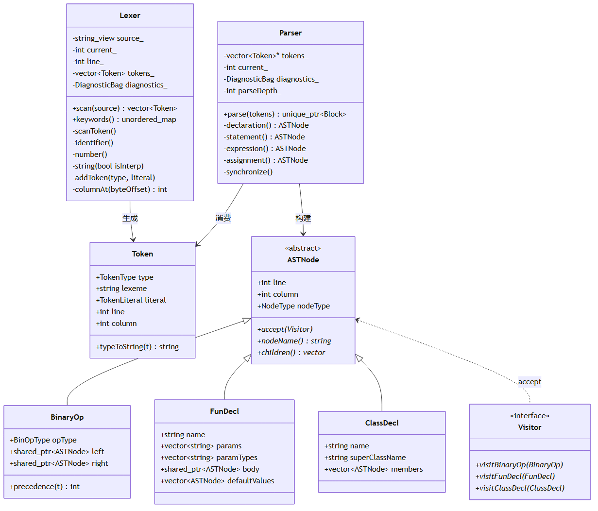{ width=90% }

### 3.2 三后端执行引擎类图

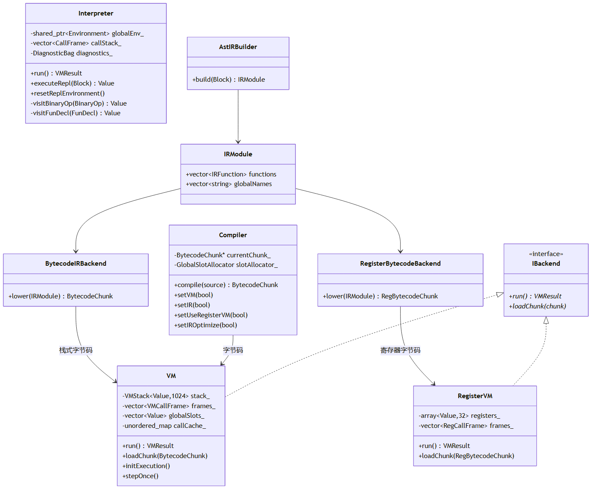{ width=90% }

### 3.3 Value 内存模型类图

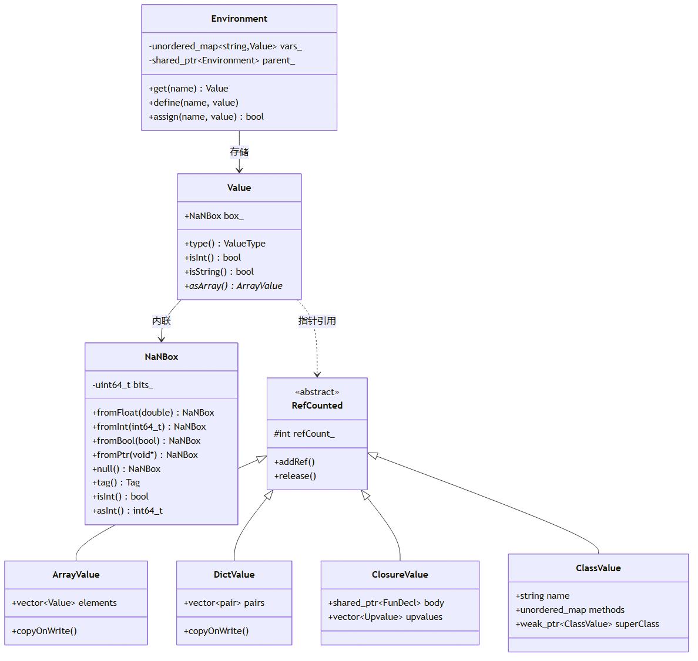{ width=90% }

### 3.4 GUI 应用层类图

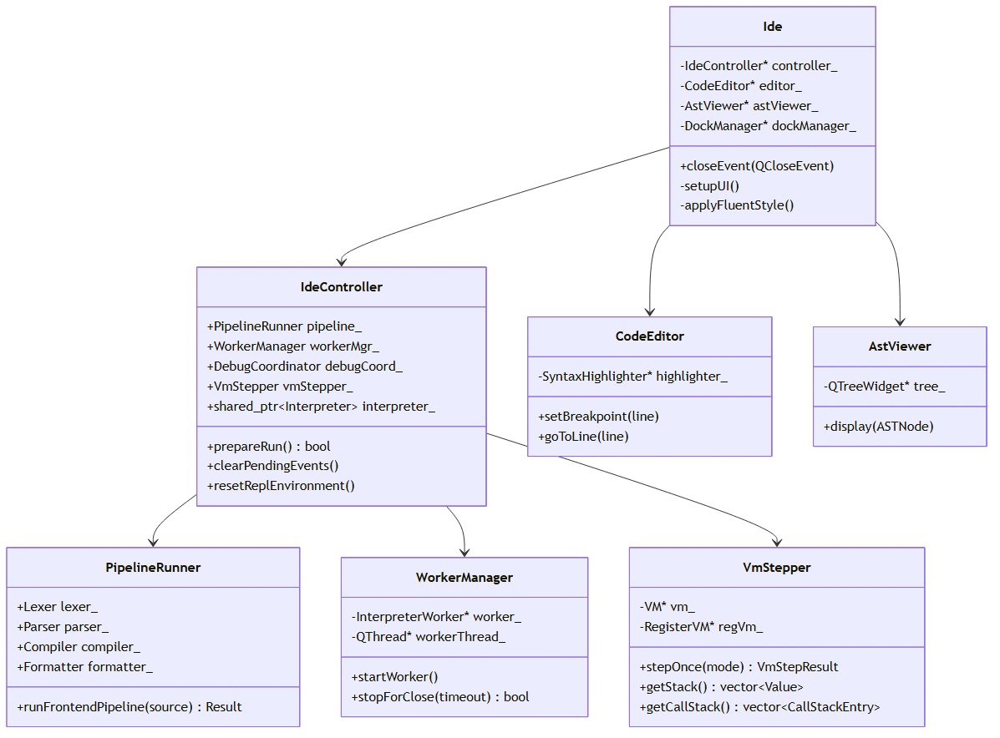{ width=90% }

---

## 第四章 关键代码说明

### 4.1 词法分析器（Lexer）

#### 4.1.1 Token 类型定义

Token 类型枚举覆盖关键字、字面量、运算符、分隔符、插值字符串标记。值得注意的是，lexer 层不依赖 interpreter 层，字面量值用 `std::variant` 存储，由 Parser 在构造 AST 节点时转换为 Value。这遵循了分层依赖原则。

```cpp
// lexer/Token.h —— Token 字面量值类型（variant 替代 Value，使 lexer 不依赖 interpreter）
using TokenLiteral = std::variant<std::monostate, int64_t, double, std::string, bool>;

struct Token {
    TokenType type;
    std::string lexeme;
    TokenLiteral literal;
    int line;
    int column;
    // ...
};
```

#### 4.1.2 扫描入口与 DoS 防护

`scan()` 入口先做源码大小上限检查，预分配容量被钳制在 MAX_TOKEN_COUNT 内防止 bad_alloc，扫描循环中检查 Token 数量上限。

```cpp
std::vector<Token> Lexer::scan(const std::string& source) {
    if (source.size() > MAX_SOURCE_SIZE) { /* 报错并返回 */ }
    // 预分配容量钳制在上限内，防止 10MB 源码预分配 110MB
    size_t reserveCap = source.size() / 8 + 16;
    if (reserveCap > MAX_TOKEN_COUNT) reserveCap = MAX_TOKEN_COUNT;
    tokens_.reserve(reserveCap);
    // 跳过 UTF-8 BOM
    while (!isAtEnd()) {
        start_ = current_;
        scanToken();
        if (tokens_.size() > MAX_TOKEN_COUNT) { break; }
    }
    // 添加 EOF Token
}
```

#### 4.1.3 locale 无关的 ASCII 分类

不使用 `std::isalpha` 等依赖 C locale 的函数，直接用 ASCII 码位比较，消除 locale 依赖，保证跨平台一致行为。

```cpp
namespace {
inline bool isAsciiDigit(char c) { return c >= '0' && c <= '9'; }
inline bool isAsciiAlpha(char c) { return (c >= 'a' && c <= 'z') || (c >= 'A' && c <= 'Z'); }
inline bool isAsciiAlphaNum(char c) { return isAsciiAlpha(c) || isAsciiDigit(c); }
}
```

### 4.2 语法分析器（Parser）

#### 4.2.1 递归下降表达式优先级链

Parser 按表达式优先级从低到高组织方法链：`expression → assignment → or → and → equality → comparison → term → factor → unary → call → primary`。每个方法处理一个优先级层次，通过 `match()` 折叠表达式零分配地匹配多个 Token 类型。

```cpp
// parser/Parser.h —— C++17 折叠表达式，零分配匹配
template <typename... Ts> bool match(Ts... types) {
    return ((check(static_cast<TokenType>(types)) ? (advance(), true) : false) || ...);
}
```

#### 4.2.2 递归深度保护

`DepthGuard` RAII 守卫构造时递增深度计数器，析构时递减（异常路径也自动递减），防止恶意嵌套栈溢出。

```cpp
struct DepthGuard {
    int& depth;
    explicit DepthGuard(int& d) : depth(d) { ++depth; }
    ~DepthGuard() { --depth; }
    DepthGuard(const DepthGuard&) = delete;
    DepthGuard& operator=(const DepthGuard&) = delete;
};
```

#### 4.2.3 AST 节点与 Visitor 模式

AST 基类 `ASTNode` 继承 `enable_shared_from_this`，使运行时可从 `ASTNode&` 获取 `shared_ptr`，用于安全持有 FunDecl 所有权（funRegistry_/ClassInfo.methods/ClosureData.body）。所有节点通过 `accept(Visitor)` 被解释器、编译器、格式化器遍历，与具体遍历逻辑解耦。

```cpp
class ASTNode : public std::enable_shared_from_this<ASTNode> {
public:
    int line = 0;
    int column = 0;
    NodeType nodeType = NodeType::NODE_NULL_LITERAL;
    virtual void accept(Visitor& visitor) = 0;
    virtual std::string nodeName() const = 0;
    virtual std::vector<ASTNode*> children() const = 0;
};
```

`NodeType` 枚举用于快速分发，替代 `dynamic_cast`。`InterpolatedString` 节点保留插值字符串的 AST 结构（交替的字面量片段与表达式），Formatter 可精确重建插值语法。

### 4.3 NaN-boxing 值编码

NaNBox 将多种类型编码到单个 64 位字中，`static_assert(sizeof(NaNBox) == 8)` 编译期保证。关键设计是 NaN 完全规范化与 Release 构建的 abort 兜底。

```cpp
// interpreter/NaNBox.h —— 编码常量（高 16 位为 tag，均含 quiet NaN bit）
static constexpr uint64_t INT_TAG_BASE = 0x7FF8000000000000ULL;  // int48
static constexpr uint64_t BOOL_TAG_BASE = 0x7FF9000000000000ULL; // bool
static constexpr uint64_t NULL_BITS = 0x7FFA000000000000ULL;     // null
static constexpr uint64_t PTR_TAG_BASE = 0x7FFB000000000000ULL;  // 指针
static constexpr uint64_t NAN_BOXED_FLOAT_MARKER = 0x7FFC000000000000ULL;

static NaNBox fromFloat(double d) {
    NaNBox box;
    std::memcpy(&box.bits_, &d, sizeof(double));
    // double 恰好落入 NaN-boxed tag 范围时，规范化为 marker，丢弃 payload
    if (isBoxedNaN(box.bits_)) box.bits_ = NAN_BOXED_FLOAT_MARKER;
    return box;
}

static NaNBox fromInt(int64_t i) {
    if (!canEncodeInt(i)) std::abort(); // Release 构建中 assert 被剥离，改 abort
    NaNBox box;
    uint64_t payload = static_cast<uint64_t>(i) & INT48_MASK;
    box.bits_ = INT_TAG_BASE | payload;
    return box;
}
```

指针解码使用零扩展而非符号扩展——Windows x64 用户空间地址（如 `0x00007FFD...`）的 bit 47 = 1，符号扩展会错误地将高 16 位填为 0xFFFF，产生无效内核地址。

### 4.4 栈式虚拟机（VM）

栈式 VM 执行 Compiler 编译生成的 BytecodeChunk（约 60 种 OpCode）。操作码定义在 `compiler/Bytecode.h`，每个 opcode 在元数据表登记一行（名称/基础长度/是否变长），新增 opcode 无需同步修改三处 switch。

```cpp
// compiler/Bytecode.h —— 统一 opcode 元数据表
struct OpCodeInfo {
    const char* name;
    uint8_t baseSize;
    bool isVariableLength;
};
const OpCodeInfo& getOpCodeInfo(OpCode op);
inline const char* opCodeName(OpCode op) { return getOpCodeInfo(op).name; }
```

VM 操作数栈使用定长数组 `Value[1024]` + 栈顶指针（PERF-13），消除 `std::vector` 的 push_back 容量检查与堆分配开销。`SmallArgs` 小缓冲区优化让方法调用参数 ≤8 时栈上内联存储。

```cpp
// compiler/VM.h —— 小缓冲区优化的参数容器
template <typename T, size_t N = 8> class SmallArgs {
    T inline_[N];
    std::vector<T> heap_;
    size_t sz_ = 0;
    // value-initialize inline_ 防 NaNBox 随机位模式被误判
    SmallArgs() : sz_(0) { for (size_t i = 0; i < N; ++i) inline_[i] = T(); }
    // 越界访问 abort（Release 构建中 assert 被剥离）
    T& operator[](size_t i) { if (i >= sz_) std::abort(); return (sz_ <= N) ? inline_[i] : heap_[i]; }
};
```

### 4.5 寄存器式虚拟机（RegisterVM）

寄存器式 VM 执行 IR lowering 生成的 RegBytecodeChunk，32 虚拟寄存器 R0-R31，约 50 条 RegOp。IR 三地址码（dest, src1, src2）直接 lowering，无需栈式序列化。

```cpp
// compiler/RegisterBytecode.h —— 寄存器式操作码（节选）
enum class RegOp : uint8_t {
    REG_LOAD_CONST, // dst, constIdx(2B)
    REG_MOVE,       // dst, src
    REG_ADD,        // dst, src1, src2
    REG_LOAD_GLOBAL,// dst, slot(2B)
    REG_CALL,       // dst, nameIdx(2B), argCount(1B), arg1, arg2, ...
    REG_RETURN,     // src
    // ...
};
```

寄存器模型：R0..R(arity-1) 参数寄存器，R(arity)..R(localCount-1) 局部变量寄存器，R(localCount)..R31 临时寄存器（IR vreg 分配）。寄存器帧使用 `std::array<Value, 32>` 零堆分配。

### 4.6 IR 中间层

IR 操作码采用三地址码风格，与 VM OpCode 解耦。`AstIRBuilder` 将 AST 转换为 IRModule，`BytecodeIRBackend` 和 `RegisterBytecodeBackend` 分别将 IRModule lowering 到栈式/寄存器式字节码。

```cpp
// compiler/IR.h —— IR 操作码（节选）
enum class IROp : uint8_t {
    LOAD_CONST,    // dest = constants[idx]
    ADD,           // dest = src1 + src2
    JUMP_IF_FALSE, // if !src jump label
    LABEL,         // 基本块标记
    // ...
};
```

优化 pass 包括：`constantFoldingPass`（常量折叠）、`copyPropagationPass`（复制传播，仅寄存器后端）、`deadCodeEliminationPass`（死代码消除）、`commonSubexpressionEliminationPass`（CSE，仅寄存器后端）、`loopUnrollingPass`（循环展开）。`optimizeIR` 组合 pass，按 round 重复执行直到收敛（最多 3 轮）。

### 4.7 应用层 Facade

`IdeController` 作为 Facade 持有 4 个协作类成员，转发公共 API。关键设计是 `clearPendingEvents()` 方法——Qt6 的 `disconnect()` 不移除已投递的 `QMetaCallEvent`，残留事件在析构链中被 dispatch 会访问已析构成员导致 UAF。

```cpp
// app/IdeController.h —— 清空所有协作成员的待处理事件
void clearPendingEvents() {
    QCoreApplication::removePostedEvents(this);
    QCoreApplication::removePostedEvents(&pipeline_);
    QCoreApplication::removePostedEvents(&workerMgr_);
    QCoreApplication::removePostedEvents(&debugCoord_);
    QCoreApplication::removePostedEvents(&vmStepper_);
}
```

REPL `%reset` 命令通过 `resetReplEnvironment()` 真正重置 REPL 环境——重建 globalEnv_、清空所有缓存（AST/字节码/IR/模块/源码/类注册表/VM 实例）。

### 4.8 程序入口

`main.cpp` 设置 DPI 自适应（PassThrough 保留分数缩放，高分辨率屏幕清晰不模糊）、加载翻译、应用 Fusion 基础样式。Ide 改为堆分配——QMainWindow 是大型对象，栈分配会在 MSVC /RTC1 Debug 构建中放置栈 cookie，析构期间越界写会触发栈损坏检查。

```cpp
int main(int argc, char* argv[]) {
    QGuiApplication::setHighDpiScaleFactorRoundingPolicy(
        Qt::HighDpiScaleFactorRoundingPolicy::PassThrough);
    QApplication a(argc, argv);
    a.setApplicationName("MiniLang IDE");
    loadMiniLangTranslations();
    a.setStyle(QStyleFactory::create("Fusion"));
    try {
        auto w = std::make_unique<Ide>();
        w->show();
        return a.exec();
    } catch (const std::exception& e) {
        QMessageBox::critical(nullptr, mlTr("MiniLang IDE - 启动错误"), QString::fromStdString(e.what()));
        return 1;
    }
}
```

---

## 第五章 运行截图说明

### 5.1 主界面布局

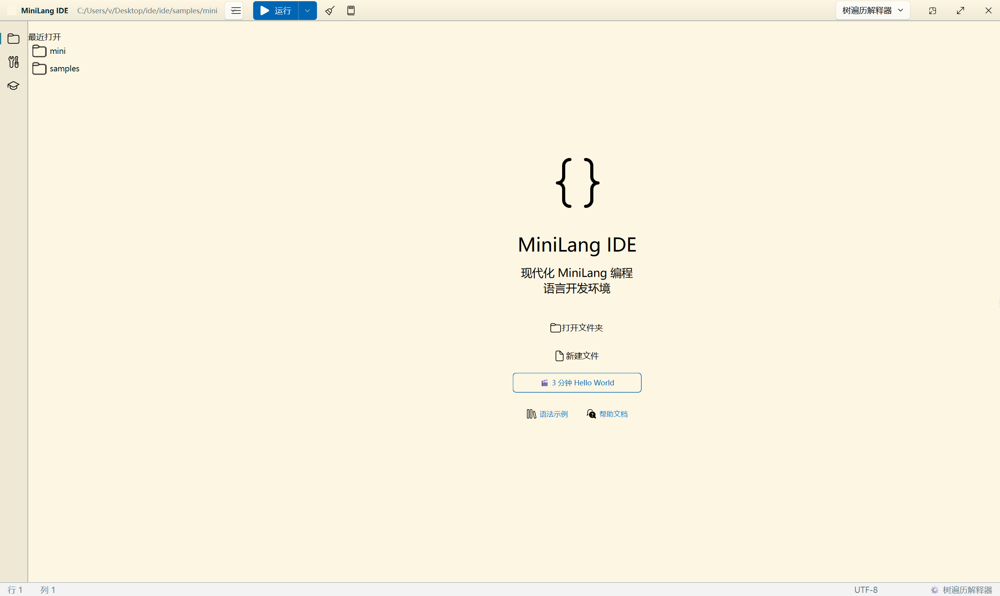{ width=80% }

MiniLang IDE 启动后的主界面，展示中央代码编辑器（语法高亮）、左侧资源管理器与调试面板、右侧教学面板停靠区、底部输出面板与 REPL。顶部为菜单栏与工具栏，采用 QFluentKit 米黄主题。主界面采用 ADS（Advanced Docking System）实现可停靠面板布局，用户可自由拖拽、浮动、自动隐藏各面板。dock widget 使用固定 objectName 确保跨 locale 的 restoreState 一致性。

### 5.2 语法高亮编辑器

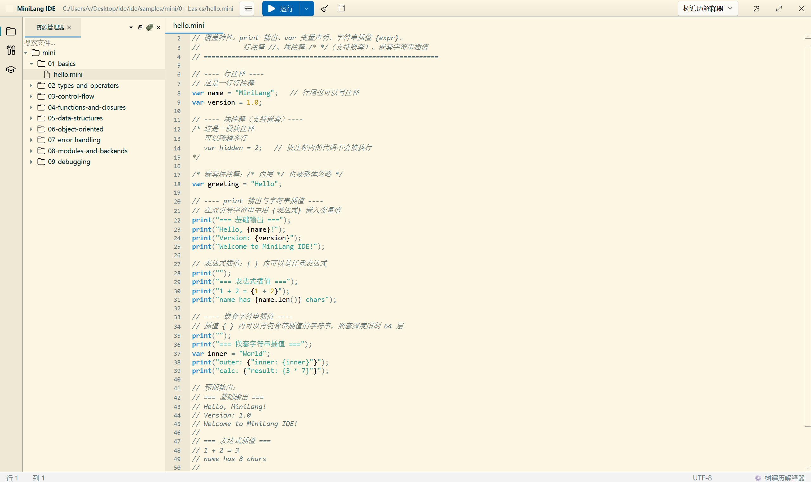{ width=80% }

编辑器中打开 `samples/mini/06-object-oriented/oop_shapes.mini` 示例文件，展示关键字（var/fun/class/extends）、字符串、数字字面量、注释的不同颜色高亮，左侧行号栏带断点标记（红点）。`CodeEditor` 基于 `QSyntaxHighlighter` 实现，支持关键字/字面量/注释/字符串插值着色，左侧行号栏支持点击设置断点。

### 5.3 AST 树形图

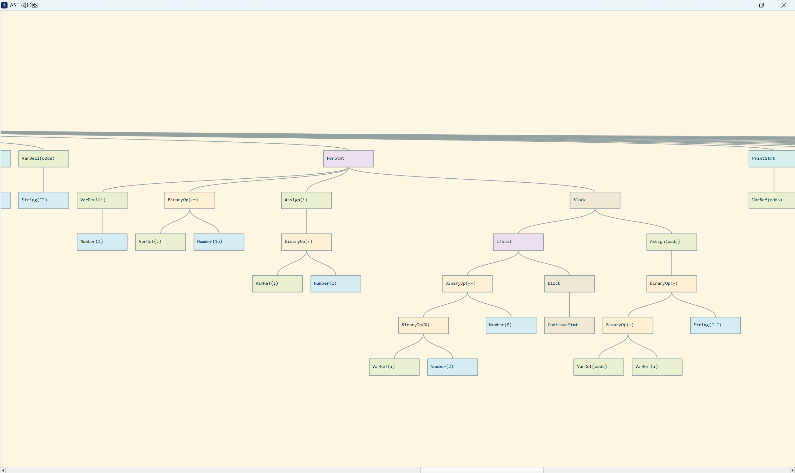{ width=80% }

右侧 AST Viewer 面板，展示 `fun fib(n) { if (n < 2) return n; return fib(n-1) + fib(n-2); }` 的 AST 层级结构：Block → FunDecl(fib) → Block → [IfStmt → BinaryOp(<) ... , ReturnStmt → BinaryOp(+) ...]。`AstViewer` 使用 `QTreeView` 展示 AST 节点层级，每个节点显示 `nodeName()` 与行号，支持点击跳转到编辑器对应位置。

### 5.4 字节码反汇编

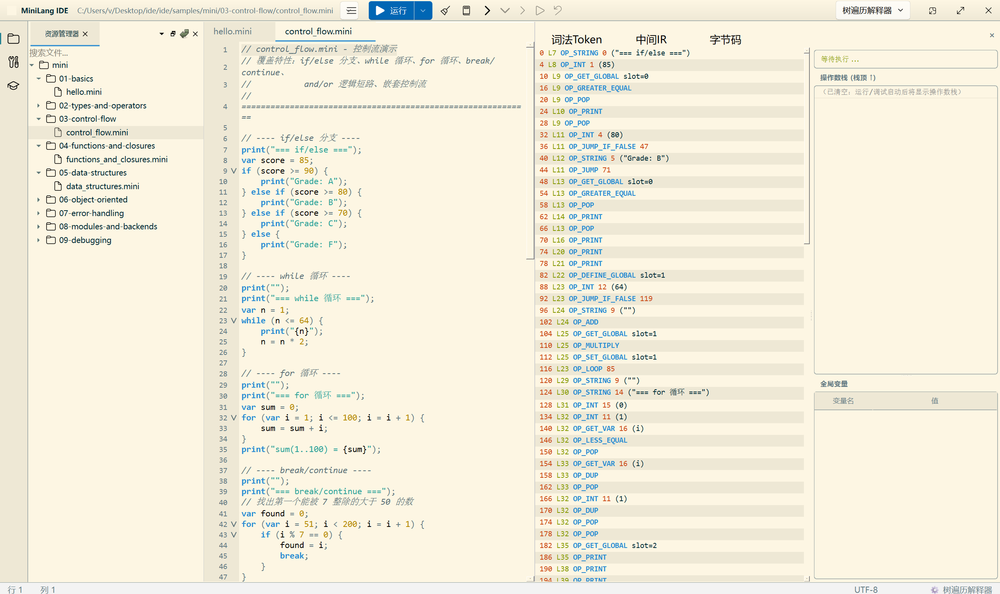{ width=80% }

字节码反汇编面板，展示 `print(1 + 2);` 编译后的栈式字节码序列：OP_INT 1 / OP_INT 2 / OP_ADD / OP_PRINT，每条指令显示 OpCode 名称、操作数、对应源码行号。

### 5.5 IR 可视化

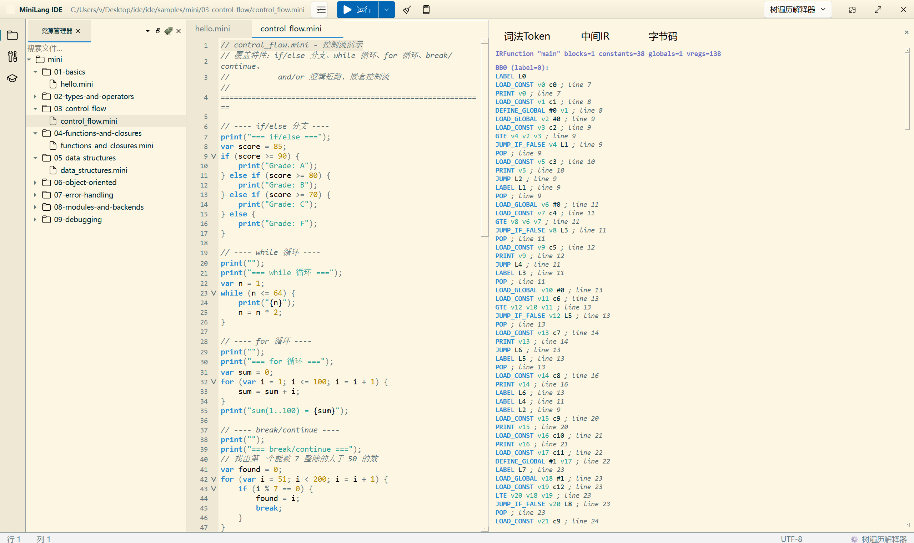{ width=80% }

IR 可视化面板，展示三地址码 IR 与优化前后对比。左侧为未优化的 IR（LOAD_CONST t0,1 / LOAD_CONST t1,2 / ADD t2,t0,t1 / PRINT t2），右侧为常量折叠优化后的 IR（LOAD_CONST t0,3 / PRINT t0）。

### 5.6 调试器

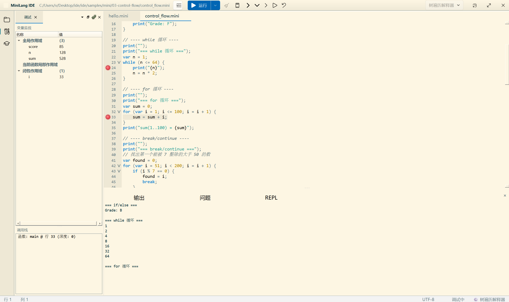{ width=80% }

调试器在断点处暂停，左侧编辑器高亮当前执行行，底部调试面板显示变量监视（局部变量名与值）、调用栈（函数名 + 行号）、单步控制按钮（step in/over/out/resume/stop）。调试器支持断点、单步（step in/over/out）、变量监视、调用栈、条件断点。条件断点求值使用沙箱隔离（Environment 快照/恢复），首行断点 pre-execution 检查。

### 5.7 REPL 与 %magic 命令

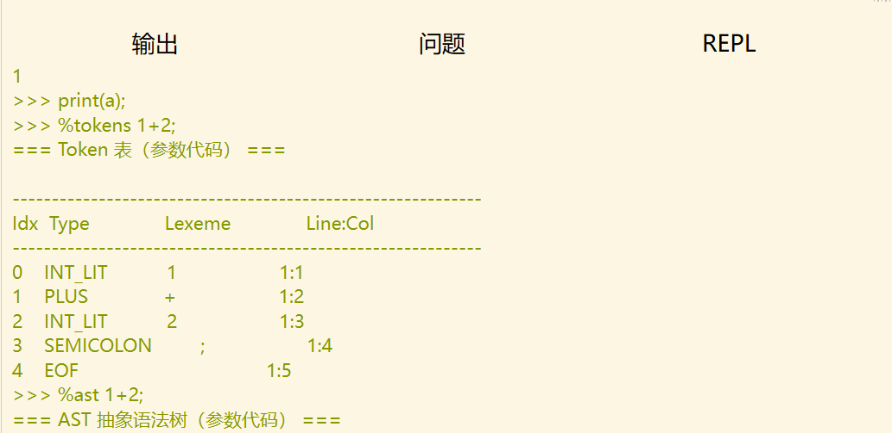{ width=80% }

底部 REPL 面板，输入 `var x = 42;` 后 `print(x);` 输出 42，随后输入 `%tokens 1+2;` 显示 Token 列表，`%ast 1+2;` 显示 AST 结构，`%disassemble 1+2;` 显示字节码反汇编。REPL 支持 `%magic` 命令系统：%ast/%tokens/%disassemble/%ir 支持参数代码（使用 ScopedAnalysis 临时实例分析，零副作用），%reset 真正重置 REPL 环境。

### 5.8 教学面板

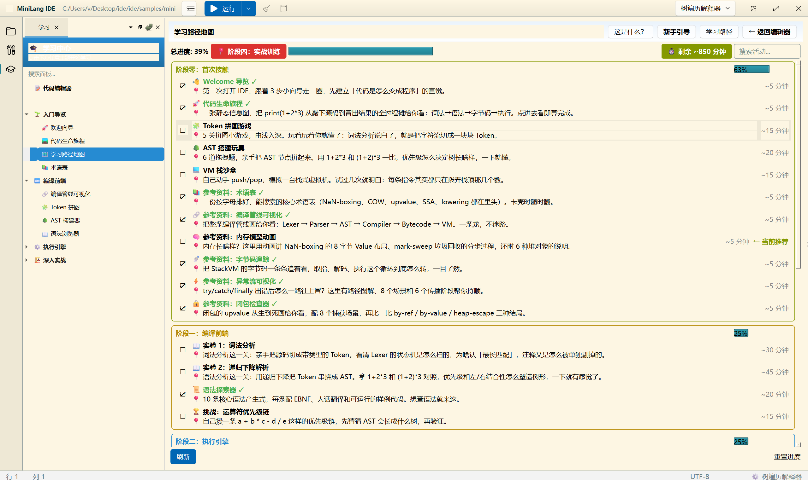{ width=80% }

右侧学习中心面板，展示学习路径树（词法分析 → 语法分析 → 语义分析 → IR → VM 等章节），每个活动项可点击进入，含预计学习时长与进度标记。

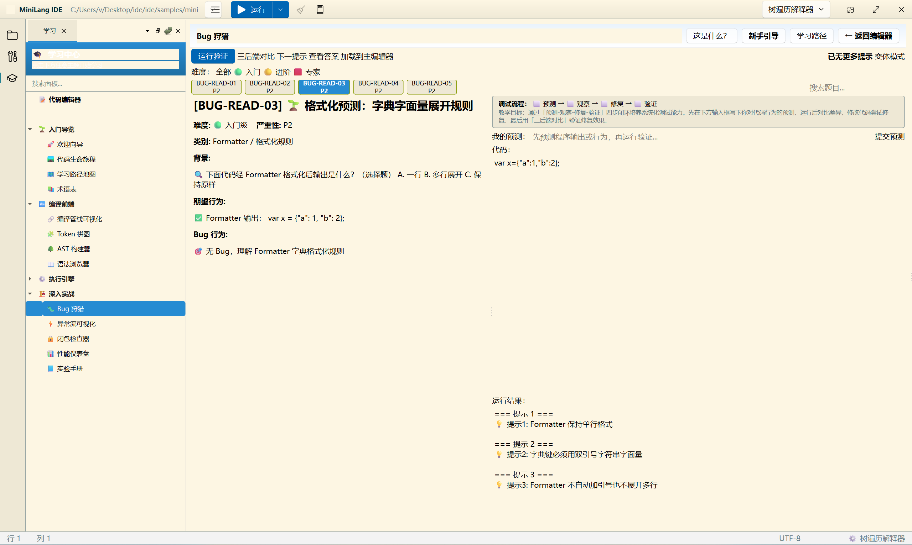{ width=80% }

BugHunt 闯关面板，展示一个含 Bug 的代码片段与多个候选修复选项，用户需识别并修复 Bug，含难度分级与变体挑战。

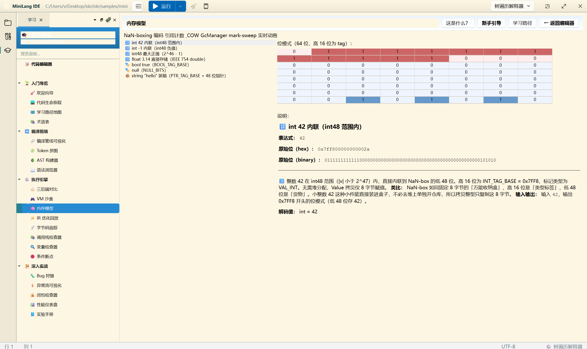{ width=80% }

内存模型面板，可视化 NaN-boxing 的值编码（高 16 位 tag + 低 48 位 payload）与 COW 数组的写时复制过程。

### 5.9 三后端对比

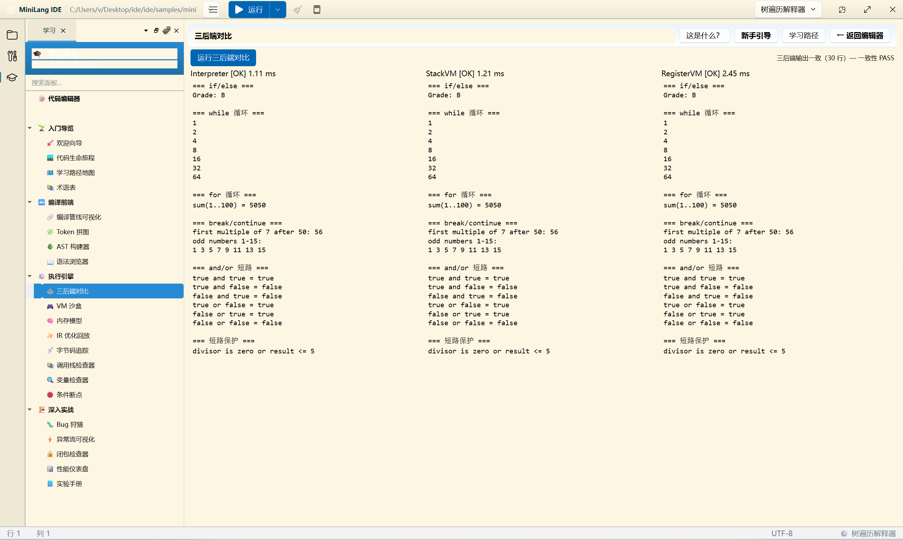{ width=80% }

三后端对比面板，同一份斐波那契源码分别在 Interpreter / StackVM / RegisterVM 上执行，显示各自的执行时间、指令计数与输出结果一致性校验。

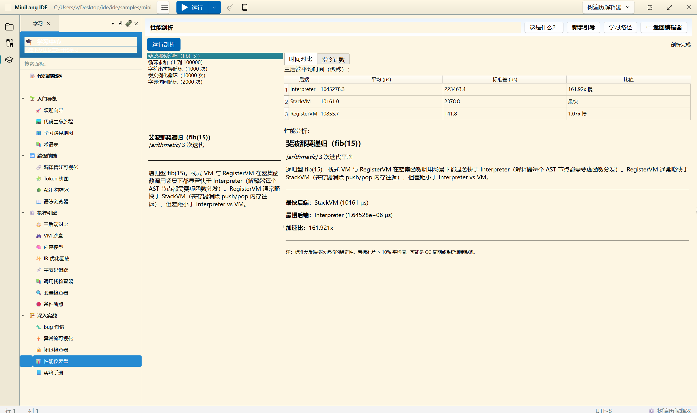{ width=80% }

性能仪表盘，展示斐波那契递归 fib(15) 的 OpCode 执行热点表（OP_CALL 执行次数 ≈1974），StackVM 与 RegisterVM 指令计数取 N 次平均，与时间统计口径一致。

---

## 第六章 测试报告

### 6.1 测试策略

MiniLang 采用多层次的测试策略，核心是**三后端一致性验证**——任何语义变更必须确保 Interpreter / StackVM / RegisterVM 三套引擎行为一致。

### 6.2 测试矩阵

三后端一致性测试覆盖 6 种组合：

| 组合 | 配置 | 说明 |
|------|------|------|
| Interpreter | 默认 | 树遍历解释器，语义基准 |
| StackVM | setVM(true) | 栈式虚拟机 |
| StackVM + IR | setVM(true) + setIR(true) | 栈式 VM + IR 中间层 |
| StackVM + IR + Opt | 上述 + setIROptimize(true) | 栈式 VM + IR 优化 |
| RegisterVM | setVM(true) + setUseRegisterVM(true) | 寄存器式 VM |
| RegisterVM + IR + Opt | 上述 + setIROptimize(true) | 寄存器 VM + 全部优化 |

### 6.3 测试套件组织

项目包含 **1773 个 GoogleTest 单元测试**（47 个测试 .cpp 文件，约 27000 行），覆盖：

| 测试类别 | 测试文件 | 覆盖范围 |
|---------|---------|---------|
| 词法分析 | TestLexer.cpp / TestLexerParserAudit.cpp | Token 识别、插值字符串拆分、错误恢复 |
| 语法分析 | TestParser.cpp | AST 构建、错误消息、嵌套深度限制 |
| 编译器 | TestCompiler.cpp / TestCompilerAudit.cpp | 字节码生成、常量池去重、作用域分析 |
| IR | TestIR.cpp / TestIRAudit.cpp / TestIROptReplayAudit.cpp | IR 生成、优化 pass、lowering 正确性 |
| 值与 NaN-box | TestValue.cpp / TestNaNBox.cpp | 编解码、边界值、NaN 规范化 |
| 三后端一致性 | TestThreeEnginesConsistency.cpp / TestThreeEnginesFuzz.cpp | 6 组合矩阵差分 + 随机程序回归 |
| 端到端 | TestVME2E.cpp / TestInterpreterE2E.cpp | 三后端端到端语义一致性 |
| 调试器 | TestDebugAudit.cpp | 调试器一致性审计 |
| 格式化器 | TestFormatterAudit.cpp | 代码格式化、插值字符串重建 |
| 内置方法 | TestBuiltinMethods.cpp | 数组/字典/字符串方法 |
| 教学面板 | TestTeachingPanelsAudit*.cpp（5 个）| 教学面板数据完整性 |
| Magic 命令 | TestMagicCommandsAudit.cpp | REPL %magic 命令系统 |
| 综合审计 | TestAuditBatch1-5.cpp | 编译器/IR/调试/三后端/内置方法 |

### 6.4 三后端一致性测试模板

每个测试用例在三后端上运行相同源码，比较输出：

```cpp
TEST(VME2EFeature, Description) {
    const char* src = R"(print("expected output");)";
    // 1. Interpreter
    Interpreter interp(src);
    auto out1 = interp.runCaptureOutput();
    // 2. StackVM
    Compiler c1; auto chunk1 = c1.compile(src);
    VM vm; vm.loadChunk(chunk1);
    auto out2 = vm.runCaptureOutput();
    // 3. RegisterVM
    Compiler c2; c2.setUseRegisterVM(true);
    auto chunk2 = c2.compile(src);
    RegisterVM rvm; rvm.loadChunk(chunk2);
    auto out3 = rvm.runCaptureOutput();
    EXPECT_EQ(out1, out2);
    EXPECT_EQ(out1, out3);
}
```

### 6.5 独立测试工具

项目包含 9 个独立于 GoogleTest 的可执行程序（`test_harness/` 目录，约 4100 行），用于特定场景的端到端验证：

| 工具 | 用途 |
|------|------|
| formatter_audit | Formatter round-trip 审计 |
| stress_test | 压力测试（大文件/深嵌套）|
| diff_test | 三后端差分测试 |
| ast_test | AST 结构验证 |
| debug_test | 调试器端到端测试 |
| audit_verify | 审计结果验证 |
| super_init_test | super.init() 调用语义 |
| super_notfound_test | super 方法未找到错误处理 |
| test_main | 通用测试入口 |

### 6.6 测试结果

全量测试通过：**1773/1773 测试用例通过，零回归**。

构建环境：MSVC 19.51 + Qt 6.10.3 + Ninja。测试运行命令：

```powershell
./out/build/debug/tests/minilang_tests.exe
# CTest 筛选特定测试
cd out/build/debug && ctest -R LexerTest.* --verbose
```

### 6.7 已知限制

1. **槽位复用**：兄弟作用域的局部变量复用同一栈槽时，slot→name 映射中后声明的变量名覆盖先前的。
2. **IR 优化与栈式 VM**：复制传播和 CSE 在栈式 VM 后端默认禁用，因与栈操作语义冲突。
3. **Ninja 依赖追踪**：修改 `Bytecode.h` 等核心头文件后可能需要全量重编译。

### 6.8 测试覆盖的演进

项目测试用例数随开发轮次持续增长，从初期几百个增长到 1773 个，每个开发轮次（共 77 轮）均要求"全量测试通过，零回归"才能合并。这种严格的测试纪律保证了三后端语义一致性的持续维护。

---

## 第七章 AI 协作案例

本章总结在 MiniLang IDE 开发过程中，与 AI agent 工具协作的三种核心方法论。这些方法论将一次性的问题解决转化为可复用的工程能力，显著提升了开发效率与质量。

### 7.1 案例一：项目记忆与规则化

#### 7.1.1 问题背景

MiniLang IDE 是一个历经 77 轮迭代的复杂项目，涉及词法分析、语法分析、IR、三套执行引擎、调试器、格式化器、Qt GUI 等多个模块。在传统开发模式下，每次新会话开始时，开发者（或 AI 助手）都需要重新理解项目架构、约束与历史决策，这导致：
- 重复造轮子——不知道已有实现而重新设计；
- 一致性破坏——不了解三后端一致性约束而只修改一个引擎；
- 高频 Bug 重现——不熟悉历史 Bug 模式而重蹈覆辙。

#### 7.1.2 解决方案：建立项目记忆机制

项目建立了三层记忆机制：

**（1）AGENTS.md 规则文件**：作为项目的"宪法"，定义了架构关键信息、执行管线、核心约束（三后端一致性）、内存模型、已知高频 Bug 模式（10 类）、排查策略与输出格式。每个新会话自动加载，保证 AI agent 始终在统一的项目认知下工作。

```markdown
## AGENTS.md（节选）
### 已知高频 Bug 模式（从历史 Changelog 总结）
1. IR 路径栈不平衡：表达式语句返回值未 POP 导致栈泄漏
2. 三后端语义不一致：错误消息文本、类型检查行为差异
3. 闭包/upvalue 生命周期：多嵌套层捕获、变量快照恢复
4. 模块系统：路径安全、循环依赖、预扫描遗漏
...
```

**（2）project_memory 项目记忆**：按日期与 session 组织的会话级记忆，记录每轮开发的目标、进度、决策与相关文件。新会话开始时快速检索历史决策，避免重复讨论。

**（3）CHANGELOG 演进历史**：每轮开发的详细记录，包括问题与修复对应表、关键设计决策、修改文件清单、测试影响。历史版本归档至 `docs/changelog/archive/`，CHANGELOG 只保留最近版本保持轻量。

#### 7.1.3 实践效果

项目记忆机制将架构约束、高频 Bug 模式、命名规范沉淀为可复用规则。例如，AGENTS.md 中记录的"QVariantAnimation 由 QUnifiedTimer 驱动，不经过 Qt 事件队列，removePostedEvents 完全无法清理它"这一认知，在第七十二轮发现 UAF 后被立即应用；第七十五轮发现 `slideInWidget` 的匿名 QPropertyAnimation 同理时，直接复用此认知快速定位根因。这种"一次认知，多次复用"的模式，将原本需要数小时排查的 UAF 问题缩短至一轮内完成。

### 7.2 案例二：模块化任务拆分

#### 7.2.1 问题背景

MiniLang IDE 的复杂度使得一次性完成所有功能不现实。早期尝试"大而全"的开发方式导致单次变更涉及多个模块，回归风险高，且难以追溯问题来源。

#### 7.2.2 解决方案：按模块独立推进

项目采用严格的模块化任务拆分策略，按编译管线职责将开发划分为 Lexer → Parser → AST → Interpreter → Compiler → IR → VM → RegisterVM → Debug → Formatter → GUI 等模块，每个模块独立推进，完成后立即补测试与文档。

**单轮开发的标准流程**：
1. **代码审读**：逐函数阅读目标模块，关注每个分支路径；
2. **边界条件枚举**：列出每个函数的所有边界输入并检查处理；
3. **三后端交叉验证**：同一语义在三条路径的实现是否一致；
4. **资源生命周期追踪**：每个 RAII guard、shared_ptr、raw pointer 的获取与释放配对；
5. **栈/寄存器平衡审计**：每个 emit 路径的 push/pop 数量是否匹配；
6. **测试与文档**：全量测试通过后更新 CHANGELOG 与 development。

每轮开发聚焦单一模块或单一问题，严格控制变更范围。例如第七十七轮仅修复性能仪表盘的指令计数口径问题（1 个 P1 + 1 个 P3），第七十四轮仅解除学习中心的学习限制（1 个功能调整）。

#### 7.2.3 实践效果

模块化拆分降低了单次变更风险，提升了可回溯性。77 轮开发形成了清晰的演进轨迹，每轮都有明确的"问题与修复对应表"，便于回溯任何修改的来龙去脉。例如，当第七十三轮发现"UI 三大顽疾"的真正根因时，通过回溯第六十七至七十二轮的修复历史，发现此前 8 轮均基于推测修复而未实际运行验证，从而调整策略采用子 agent 系统性审查 ADS 源码找到真正根因。

每轮开发的"全量测试通过，零回归"纪律，确保了模块化拆分不会破坏已有功能。测试用例数从初期几百个增长到 1773 个，为模块化开发提供了安全网。

### 7.3 案例三：规则沉淀为 Skill

#### 7.3.1 问题背景

在 77 轮开发中，某些类型的问题反复出现：
- 构建诊断（CMake 配置、MSVC/Ninja 编译错误、Qt 部署）；
- UI 样式调试（QSS 不生效、ADS 样式覆盖、QPalette 与 QSS 优先级）；
- closeEvent UAF（不同类型的动画/定时器/事件未清理）。

每次从头排查这些问题耗费大量时间，且容易遗漏已知的解决模式。

#### 7.3.2 解决方案：总结为可复用 Skill

将反复出现的问题及其解决方法论总结为 Skill（技能），相似问题直接调用，把一次性解决变成可复用能力。例如：

**（1）minilang-build Skill**：专门处理 MiniLang 构建问题诊断与解决方案，覆盖 CMake 配置、编译器错误、链接失败、windeployqt 路径等。当遇到构建问题时直接调用，避免重复搜索 CMake 文档与 Stack Overflow。

**（2）UI 样式调试经验沉淀**：第七十三轮发现的"Item delegate 是样式盲区"（delegate 的 paint() 直接绘制，绕过所有 QSS/palette）、"restoreState 创建新 widget 需要后续样式化"、"objectName 不能依赖 i18n"等认知，被沉淀为 UI 样式调试的检查清单。后续遇到 UI 样式问题时，按清单系统性排查而非凭推测。

**（3）closeEvent UAF 排查清单**：第七十二轮发现的"QVariantAnimation 由 QUnifiedTimer 驱动不受 removePostedEvents 控制"认知，第七十五轮扩展到"QPropertyAnimation 同理"，第七十六轮扩展到"QTimer 也需 stop"。这些认知被沉淀为 closeEvent UAF 排查的完整清单：QPropertyAnimation / QVariantAnimation / QTimer / QUnifiedTimer 驱动的动画 / 纯 C++ 观察者回调，每类对象都需要在 closeEvent 中显式清理。

#### 7.3.3 实践效果

Skill 机制显著提升了重复问题的解决效率。以 closeEvent UAF 为例，第六十六轮首次排查 removePostedEvents API 误用耗时较长；第七十二轮发现 QVariantAnimation 问题后建立认知；第七十五轮、第七十六轮遇到类似问题时，直接复用已有认知清单快速定位，每轮均在一次迭代内完成修复。

这种"问题 → 认知 → Skill → 复用"的闭环，使项目的工程能力持续积累。77 轮开发过程中，每次新发现的问题模式都被记录到 AGENTS.md 的高频 Bug 模式列表或沉淀为 Skill，后续会话自动受益。

### 7.4 AI 协作方法论总结

三种方法论形成完整的 AI 协作闭环：

| 方法论 | 核心价值 | 沉淀形式 |
|--------|---------|---------|
| 项目记忆与规则化 | 保证跨会话一致性，避免重复造轮子 | AGENTS.md / project_memory / CHANGELOG |
| 模块化任务拆分 | 降低单次变更风险，提升可回溯性 | 单轮单模块 + 全量测试纪律 |
| 规则沉淀为 Skill | 把一次性解决变成可复用能力 | Skill 技能 + 排查清单 |

这三者相互支撑：项目记忆为模块化拆分提供上下文，模块化拆分为 Skill 沉淀提供清晰的案例，Skill 沉淀又反哺项目记忆的规则更新。整个开发过程形成了"记忆 → 拆分 → 沉淀 → 记忆"的螺旋上升，使 MiniLang IDE 在 77 轮迭代中保持高质量演进，累计修复数百个 Bug 而零回归。

---

## 第八章 开发工具

### 8.1 AI Agent 工具

本项目开发过程中使用了多种 AI agent 工具，覆盖代码补全、单元测试生成、调试辅助、文档撰写、PPT 生成等场景。

#### 8.1.1 TRAE

TRAE 是本项目的主力 AI agent 工具，作为 IDE 内嵌的智能编程助手，承担了核心开发任务：

- **代码补全与生成**：在编写 Lexer、Parser、VM 等模块时，TRAE 根据上下文补全代码，生成符合项目命名规范与架构约束的实现。其内置的项目记忆机制（AGENTS.md）确保生成的代码与三后端一致性约束对齐。
- **单元测试生成**：基于三后端一致性测试模板，TRAE 自动生成 TestVME2E 风格的测试用例，覆盖正常路径、边界条件与三后端差分。1773 个测试用例中有相当比例借助 TRAE 生成或补全。
- **调试辅助**：面对 closeEvent UAF、IR 栈不平衡等复杂问题，TRAE 结合 AGENTS.md 中的高频 Bug 模式清单与排查策略，系统性审查代码路径，定位根因并给出修复建议。其排查流程（代码审读 → 边界条件枚举 → 三后端交叉验证 → 资源生命周期追踪 → 栈/寄存器平衡审计）显著提升了调试效率。
- **文档撰写**：TRAE 根据代码变更自动维护 CHANGELOG、development.md、ADR 决策记录，确保文档与代码同步。每轮开发结束后的"修改文件清单 + 测试影响"摘要均由 TRAE 生成。
- **PPT 生成**：TRAE 的 PPT 技能用于生成答辩演示文稿（见 `ppt/MiniLang答辩/`），将架构图、UML、运行截图组织为可滚动的网页式幻灯片。

#### 8.1.2 WorkBuddy

WorkBuddy 作为辅助 AI agent 工具，主要用于：
- 代码审查与质量检查，识别潜在的资源泄漏、竞态条件；
- 跨模块影响分析，评估语义变更对三后端的影响范围；
- 重构建议，如将 God Object 拆分为 4 个协作类的 Facade 重构。

#### 8.1.3 QoderWork

QoderWork 作为补充 AI agent 工具，主要用于：
- 生成代码注释与 API 文档，保持注释与代码语义一致；
- 辅助编写教学面板的静态数据（Library 数据嵌入 .cpp），如 BugHunt 题库、学习路径数据；
- 生成测试数据与 fuzz 测试的随机程序种子。

### 8.2 传统开发工具

| 工具 | 用途 |
|------|------|
| CMake ≥3.25 | 跨平台构建系统，配置 Debug/Release 预设 |
| MSVC 19.51 / GCC 13 / Clang 16 | C++20 编译器 |
| Qt 6.10.3 | GUI 框架（Core/Gui/Widgets/Svg/Xml）|
| Ninja | 构建后端，加速增量编译 |
| GoogleTest | 单元测试框架 |
| Git | 版本控制 |
| Docker | 容器化构建环境（Linux）|
| ADS（Advanced Docking System）| 第三方 Qt 停靠面板库 |
| QFluentKit | 第三方 Fluent 主题组件库 |

### 8.3 工程基础设施

| 设施 | 说明 |
|------|------|
| GitHub Actions CI | Windows/Linux 自动化构建与测试 |
| clang-format / clang-tidy | 代码风格与静态检查 |
| Doxygen | API 文档生成 |
| CMakePresets.json | 构建预设管理 |
| configure.bat / build.sh | 跨平台构建脚本 |

### 8.4 AI 协作的工具链整合

三种 AI agent 工具在项目中形成互补：TRAE 作为主力承担核心开发与调试，WorkBuddy 侧重代码审查与架构分析，QoderWork 补充文档与数据生成。三者共享项目记忆（AGENTS.md / project_memory），确保协作一致性。这种多工具协同的模式，使单轮开发能在保证质量的前提下高效完成。

---

## 第九章 个人总结

### 9.1 项目成果

MiniLang IDE 成功实现了一个端到端、可对比、可可视化的教学型编程语言集成开发环境，核心成果包括：

1. **完整编译管线**：从源代码到执行结果的全流程实现，包括词法分析、递归下降解析、AST、IR 中间层（含 5 种优化 pass）、栈式字节码编译、寄存器式字节码编译。
2. **三套执行引擎**：树遍历解释器、栈式 VM（约 60 OpCode）、寄存器式 VM（约 50 RegOp），三者语义等价，支持教学对比。
3. **完整 Qt GUI**：语法高亮编辑器、AST 树形图、字节码反汇编、IR 可视化、调试器（断点/单步/条件断点）、代码格式化器、REPL（含 %magic 命令）、20+ 教学面板。
4. **健壮的工程基础**：1773 个 GoogleTest 单元测试，零回归的 77 轮迭代，NaN-boxing 内存优化，DoS 防护，线程安全，跨平台支持。

### 9.2 技术收获

通过本项目，我深入掌握了编译原理与运行时系统的核心知识：

- **词法分析与语法分析**：手写扫描器与递归下降解析器的实现，理解了错误恢复、递归深度保护、插值字符串词法拆分等工程实践。
- **中间表示与优化**：三地址码 IR 的设计，常量折叠、死代码消除、复制传播、CSE、循环展开等优化 pass 的实现，以及优化安全性约束（如 CSE 在栈式 VM 不安全）。
- **虚拟机设计**：栈式与寄存器式两种 VM 架构的取舍，操作数栈定长数组优化，寄存器帧零堆分配，内联缓存。
- **内存模型**：NaN-boxing 值编码的精妙设计，COW 与引用计数的配合，GC 循环引用检测。
- **Qt GUI 工程**：Facade 模式拆分 God Object，ADS 停靠面板布局，线程安全的 Worker 模型，closeEvent 资源清理的复杂性。

### 9.3 工程实践认知

77 轮迭代开发让我深刻体会到工程实践的若干关键点：

**（1）测试纪律是质量的基石**。每轮"全量测试通过，零回归"的纪律，使模块化拆分成为可能。1773 个测试用例构成的安全网，让每次修改都有信心不破坏已有功能。三后端一致性测试矩阵尤其重要——它强制开发者在修改语义时同时考虑三套引擎，避免一致性破坏。

**（2）UAF 是 Qt 应用的核心难题**。closeEvent 期间的资源清理涉及多种对象类型（QPropertyAnimation、QVariantAnimation、QTimer、纯 C++ 观察者回调），每种对象的清理方式不同。第七十二、七十五、七十六轮的 UAF 修复让我建立了完整的 closeEvent 清理清单。

**（3）UI 问题需要系统性排查而非推测**。第七十三轮的教训深刻——8 轮基于推测的 UI 修复均无效，最终通过子 agent 系统性审查 ADS 源码、delegate、QFluentKit 才找到真正根因（Item delegate 绕过所有样式机制）。UI 异常时优先检查 item delegate 的 paint 方法、restoreState 的时序、objectName 的稳定性。

**（4）文档与代码同等重要**。AGENTS.md、CHANGELOG、ADR 决策记录构成了项目的知识沉淀。AGENTS.md 的高频 Bug 模式清单让新会话快速受益；CHANGELOG 的"问题与修复对应表"让任何修改可回溯；ADR 记录了架构决策的背景与取舍。

### 9.4 AI 协作的反思

与 AI agent 工具的协作让我重新思考了人机协作的边界：

**AI 擅长的**：代码补全、单元测试生成、系统性代码审查、文档维护、模式识别（从历史 Bug 模式快速定位新问题）。TRAE 的项目记忆机制使其能在统一的项目认知下工作，避免重复造轮子。

**人类不可或缺的**：架构决策的取舍判断、用户需求的优先级排序、UI 体验的主观评估、复杂时序问题的根因推理。例如"三后端一致性"这一核心约束是人类基于教学目标做出的决策，AI 在此约束下执行但不会自行提出。

**协作的关键**：建立项目记忆与规则化机制，让 AI 在统一上下文下工作；模块化任务拆分，让每次协作聚焦单一问题；规则沉淀为 Skill，把一次性解决变成可复用能力。这三者构成了高效的 AI 协作闭环。

### 9.5 不足与展望

**当前不足**：
- IR 优化 pass 在栈式 VM 后端受限（CSE/复制传播默认禁用）；
- 槽位复用导致 slot→name 映射不精确；
- 部分 UI 时序问题（竞态/UAF）难以用单元测试覆盖。

**未来展望**：
- 引入 SSA 形式的 IR，解除栈式 VM 的优化限制；
- 增加 JIT 编译路径，展示更高性能的执行模型；
- 扩展教学面板，增加数据流分析、寄存器分配可视化；
- 完善国际化，支持多语言界面。

### 9.6 结语

MiniLang IDE 的开发是一次从零构建完整编程语言的深度实践。77 轮迭代、1773 个测试、数百个 Bug 修复，让我不仅掌握了编译原理与运行时系统的技术细节，更建立了系统性的工程方法论——项目记忆、模块化拆分、Skill 沉淀。这套方法论与 AI agent 工具结合，使复杂项目的持续高质量演进成为可能。本项目既是编译原理课程设计的成果，也是 AI 时代软件工程实践的一次有益探索。

---

**附录：项目关键数据**

| 指标 | 数值 |
|------|------|
| 开发轮次 | 77 轮 |
| 单元测试用例 | 1773 个 |
| 测试套件 | 47 个 .cpp 文件，约 27000 行 |
| 独立测试工具 | 9 个，约 4100 行 |
| OpCode 数量（栈式）| 约 60 种 |
| RegOp 数量（寄存器式）| 约 50 种 |
| AST 节点类型 | 30 种 |
| 教学面板 | 20+ 个 |
| 构建验证 | MSVC 19.51 + Qt 6.10.3 + Ninja |
| 跨平台 | Windows / Linux / macOS |
```
